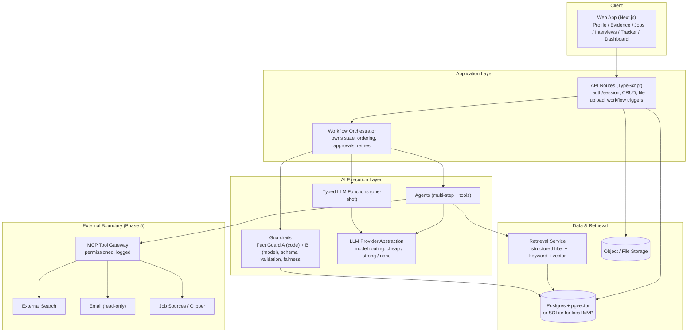
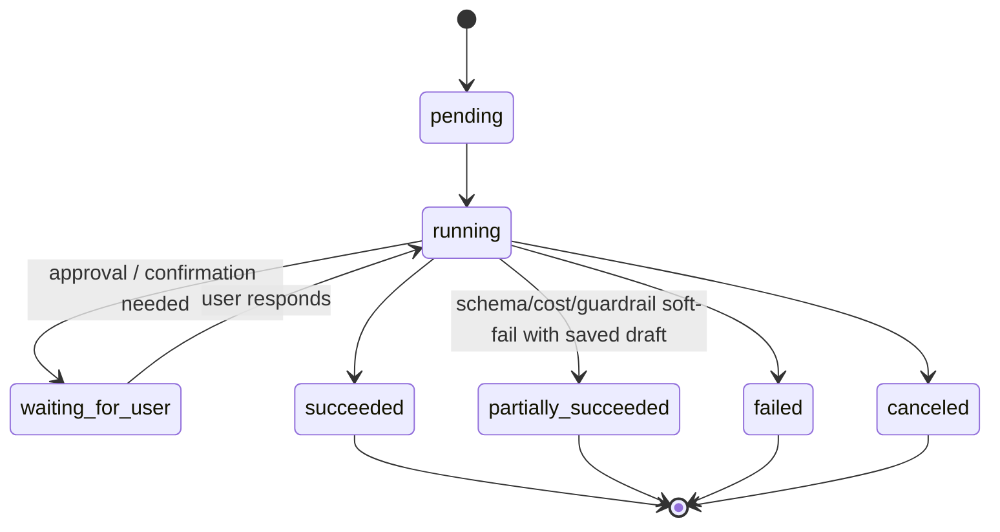
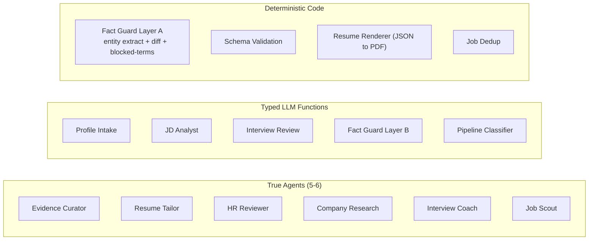
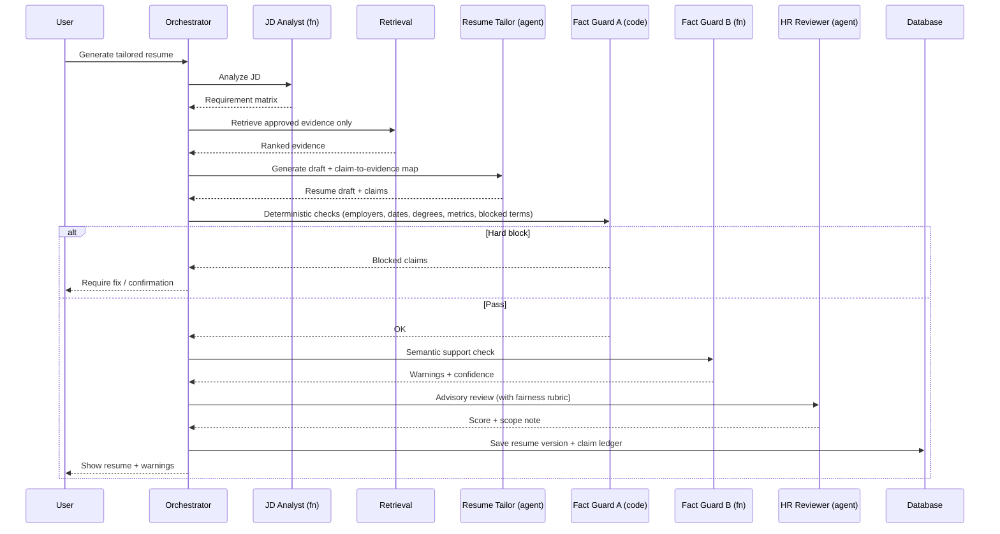
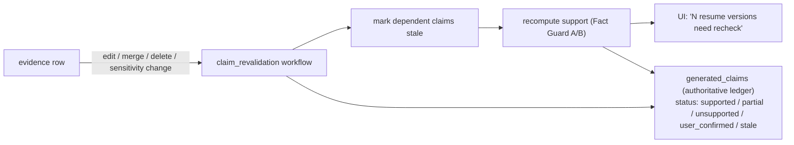
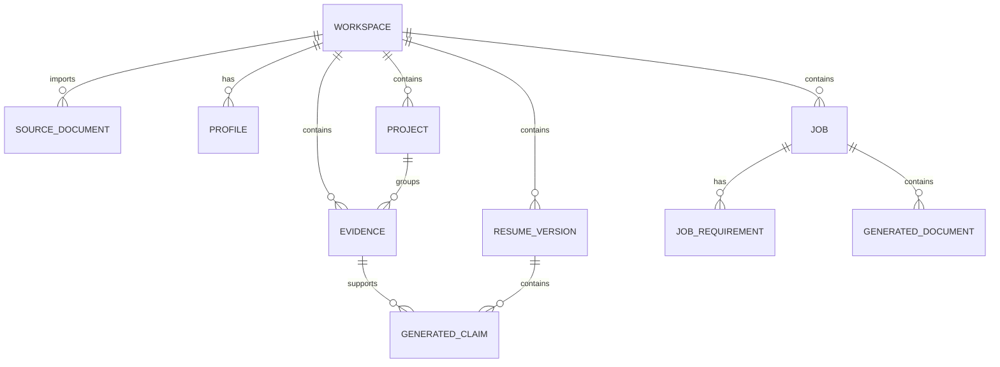
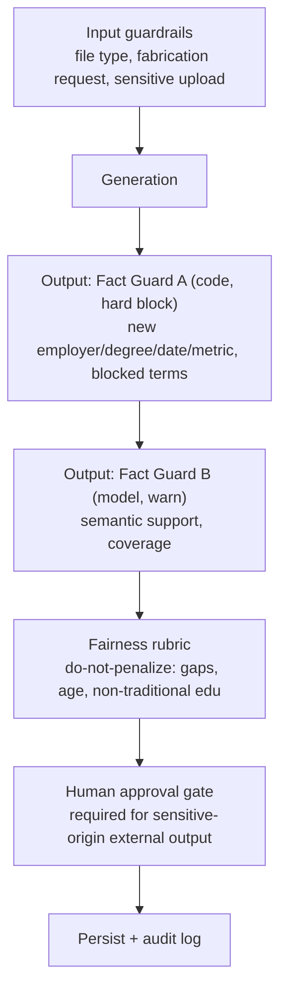
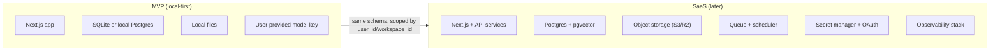

# Job Search Copilot — Overall Architecture (diagram-first companion)

Status: Target architecture (diagram-first view)
Date: 2026-06-09
Role in doc set: the consolidated, diagram-first view of the system. For the
authoritative system-level spec see `design-doc.md`; for per-component
build/learning detail see `build-and-learn.md`; for product requirements see
`prd.md`.
Resolved assumptions (now decisions, see design-doc §21.4 / §23.8 / §24):
local-first single-user MVP, TypeScript end-to-end, primary persona = experienced
professional.

This document is a consolidated, diagram-first view of the recommended architecture.
It reflects the agreed design: ~5-6 true agents (not 11-12), a two-layer Fact
Guard (deterministic + model), a living claim-evidence ledger, and a thin
local-first footprint that can grow into SaaS without a data-model rewrite.

Note: earlier review feedback has been folded into `design-doc.md` and
`build-and-learn.md`; this architecture file should stand on its own.

---

## 1. Layered View

Key principle (unchanged from design 4.1): the **application owns orchestration**.
Agents and functions are constrained workers. They never decide the whole workflow.

---

## 2. Component Responsibilities

| Layer | Component | Responsibility | MVP? |
|-------|-----------|----------------|------|
| Client | Web App | Workspace UI, explicit AI actions, approval modals | Yes |
| App | API Routes | Auth/session, CRUD, upload, workflow triggers, access control | Yes |
| App | Orchestrator | Workflow state, step ordering, approval pauses, retries, persistence | Yes |
| AI | Agents | Multi-step reasoning + tool use (see Section 4) | Partial |
| AI | Typed LLM Functions | One-shot structured extraction/parse | Yes |
| AI | Guardrails | Fact Guard A/B, schema validation, fairness, sensitive-term block | Yes |
| AI | Provider Abstraction | Model routing, vendor independence, local-mode | Yes |
| Data | Retrieval | Evidence selection (structured + keyword + vector) | Yes |
| Data | Postgres/SQLite | Source of truth for profile, evidence, claims, jobs | Yes |
| Data | Object Storage | Uploaded docs, rendered exports | Yes |
| External | MCP Gateway + tools | Email, job sources, search, clipper, calendar | Phase 5 |

---

## 3. Workflow Orchestration Model

Every workflow run is a persisted record (id, user_id, workspace_id, type, status,
current_step, input/output payload, error). The UI subscribes to step events for
progress. Approvals are explicit pause points, not background magic.

---

## 4. AI Execution: Agents vs Functions vs Code

Something is an *agent* only if it needs multi-step reasoning with tool use;
otherwise it is a typed LLM function or plain code.

| Name | Type | Model tier | Blocking authority |
|------|------|-----------|--------------------|
| Profile Intake | LLM function | Cheap | No |
| Evidence Curator | Agent | Strong | No |
| De-identification | Skill/step in Evidence Curator | Cheap/Strong | Feeds Layer A |
| JD Analyst | LLM function | Cheap | No |
| Resume Tailor | Agent | Strong | No |
| HR Reviewer | Agent | Strong | No (advisory) |
| Fact Guard Layer A | Code | None | Yes (hard block) |
| Fact Guard Layer B | LLM function | Cheap/Strong | Warning only |
| Company Research | Agent | Strong | No |
| Interview Coach | Agent | Strong | No |
| Interview Review | LLM function | Strong | No |
| Job Scout | Agent | Strong | No |
| Pipeline Tracker | Classifier + rules | Cheap | No (read-only) |

---

## 5. The Grounding Spine (critical path)

This is the loop that proves the product thesis. Build this first.

---

## 6. Claim-Evidence Ledger (living provenance)

This converts Fact Guard from a one-shot gate into a continuous integrity system.
It is the difference between "looked grounded once" and "stays grounded."

---

## 7. Data Model (MVP core)

Only the tables the grounding spine needs. The full set is in design-doc Section 7.

Tables for MVP: `workspaces`, `source_documents`, `profiles`, `projects`,
`evidence`, `jobs`, `job_requirements`, `resume_versions`, `generated_documents`,
`generated_claims`. Defer: interviews, reviews, applications, external_sources,
tool_call_logs (add as their phases arrive).

---

## 8. Trust & Safety Architecture

Approval is non-skippable for any content marked `sensitivity_level = sensitive`
before it reaches an external-facing document.

---

## 9. Deployment Footprint Evolution

The data model is multi-tenant-ready from day one (every row scoped by
`user_id`/`workspace_id`), so the local-first MVP promotes to SaaS without a
rewrite. Queues, OAuth, schedulers, and the MCP external tools arrive with SaaS
and Phase 5 automation, not before.

---

## 10. Build Order (maps to this architecture)

1. Stage 0: decisions (D4-D6), app shell, provider abstraction, core schema.
2. Stage 1: grounding spine (Sections 5-6) — import, evidence, tailor, Fact Guard A, export.
3. Stage 2: golden eval set as CI gate.
4. Stage 3: Fact Guard B, HR Reviewer + fairness, cover letters, de-identification.
5. Stage 4: interview loop, then application tracker/dashboard.
6. Stage 5: MCP external boundary — job scout, email, browser clipper.

---

## 11. Decisions Taken & Remaining Open Items

Resolved (now decisions in design-doc.md, not open):
- D4 — Deployment: **local-first single-user MVP**, cloud-ready boundaries
  (design-doc §21.4).
- D5 — Primary persona: **experienced professional**.
- D6 — Runtime: **TypeScript end-to-end** for MVP (design-doc §23.8).
- Retrieval: **single embeddings table + `index_type`** for MVP; pgvector locally
  or an in-process cosine fallback acceptable; no separate stores/reranking yet
  (design-doc §8.2, build-and-learn §4.11).

Genuinely still open:
- High-quality PDF/DOCX renderer choice (design-doc open Q1; build-and-learn §8.10).
- Whether Company Research / Job Scout (external boundary) are in scope for the
  first releasable version, given ToS/legal review needs.
- Exact entity-extraction approach for Fact Guard Layer A (pure code vs a
  constrained-model front-end) — to be decided empirically (build-and-learn §6.10).
