# Job Search Copilot — Build & Learn Design Doc

Version: 0.1 (in progress, written component-by-component)
Date: 2026-06-09
Purpose: This is the working design doc for building Job Search Copilot as a
self-learning project. For each essential component we capture both the design
(what we build) and the learnings from our own naive-then-hardened build). We do
not call private or proprietary APIs. External public APIs or hosted model
providers are only allowed behind our own interfaces, with logging,
user-configured keys, and explicit phase boundaries.

Companion docs:
- prd.md — product requirements
- design-doc.md — full technical architecture (v0.4)
- architecture.md — diagram-first target architecture
- skills/ — versioned SKILL.md instruction packs (see "Skills & MCP plan" below)
- src/schemas/ + SETUP.md — canonical Zod data contracts. The per-component
  "Zod sketch" blocks below are now realized as runnable schemas there for the
  grounding spine (shared, profile, evidence, jd-analysis, tailored-resume);
  the sketches remain as inline design references.

---

## How to read this doc

Each component is written with the same template so we can compare them and keep
the learning notes consistent:

1. **Purpose** — what the component is responsible for, in one paragraph.
2. **Where it fits** — its place in the workflow / which stage of the spine.
3. **Inputs and outputs** — the contract (schemas sketched, not final).
4. **Naive version (build first)** — the simplest thing that works, built to
   expose why the problem is hard.
5. **Failure modes observed** — what breaks in the naive version. This is the
   lesson; we build the naive version specifically to find these.
6. **Hardened version** — the design that addresses the failures, with the
   borrowed pattern named.
7. **Learnings borrowed** — prior art we studied, what it taught us, and the
   source. We borrow knowledge, not code or APIs.
8. **Benchmark to clear** — the measurable bar that tells us the component is
   good enough on our own test set.
9. **Guardrails** — safety/quality rules specific to this component.
10. **Open questions** — what we still need to decide.

Learning principle for the whole project: **build each component twice in
spirit** — first naive (to understand why it is hard), then hardened (applying
the borrowed lesson). The failure of the naive version IS the learning.

Scope calibration (applies to every component): **design each component to be
functionally complete** — no critical correctness step is dropped or sacrificed
for "MVP." A component must actually work end to end and handle the real cases
its job implies (e.g. multi-column resumes, mangled dates). At the same time,
**stay within personal-project scope** — we do NOT add production/operational
concerns: no non-prod/prod deployment pipelines, no autoscaling, no
multi-tenant infra, no monitoring/on-call/OE tooling, no caching/perf
optimization unless it is required for the component to function. The test for
including something: "is this needed for the component to be correct and
complete?" (include it) vs "is this needed to run it as a production service at
scale?" (leave it out). Metrics we define are for our own learning/evaluation,
not operational dashboards.

---

## Component build order (grounding spine first)

We design in the order we will build, so the doc grows along the critical path.

1. Resume Import / Profile Intake  ← (this draft)
2. Evidence Library / Evidence Curator
3. JD Analyst
4. Retrieval / Personal RAG
5. Resume Tailor
6. Fact Guard Layer A (deterministic) + Layer B (semantic)
7. HR Reviewer (with fairness)
8. Document Render / Export + visual validation loop

Later (post-spine):
9. Interview Coach
10. Interview Review
11. Company Research
12. Job Scout
13. Pipeline Tracker

---

## 1. Resume Import / Profile Intake

Status: Build-ready component note — first component.

### 1.1 Purpose

Convert an uploaded resume (PDF/DOCX/Markdown/text) into a structured, canonical
profile (contact, education, work experience, skills, dates) that becomes the
source of truth for everything downstream. Every later component — evidence,
tailoring, fact-checking — trusts this profile, so its single most important
property is **faithfulness**: it must contain only what the document actually
says, with traceability back to the source text.

### 1.2 Where it fits

First stage of the grounding spine. Output (the canonical profile) feeds the
Evidence Library, the Resume Tailor, and Fact Guard's comparison set. If this
stage invents or drops facts, the error propagates everywhere.

### 1.3 Inputs and outputs

Input:
- Raw uploaded file (PDF/DOCX/MD/TXT).
- Extracted plain text + light layout hints.

Output (sketch — to become `profile.schema.json`):
- `profile`: structured fields (contact, education[], experience[], skills[],
  certifications[]).
- `field_confidence`: per-field confidence + the source text span it came from.
- `missing_fields`: fields the schema expects but were not found.
- `low_confidence_fields`: fields needing user review.
- `invented_field_flags`: fields the model produced that have NO matching source
  span (must be zero or surfaced loudly — see learnings).

### 1.4 Naive version (build first)

- Extract text from the file with a basic parser.
- Send the whole text to one LLM call: "extract this resume into JSON matching
  this schema."
- Save the JSON as the profile.

We build this first on purpose. It will mostly work and will feel done. The point
is to then measure where it quietly fails.

### 1.5 Failure modes observed (the lesson)

These are the failures we expect the naive version to reveal:
- **Invented fields.** The model fills plausible-but-absent values (a city, a
  graduation year, a job title it inferred). This is the core hallucination risk
  and the hardest to notice because the output looks clean.
- **Date/format mangling.** Text extraction garbles dates ("Jun 2019 - Present",
  "06/19", "2019–2021") and the model normalizes inconsistently.
- **Layout loss.** Two-column resumes and tables get linearized, so skills bleed
  into experience or bullets attach to the wrong job.
- **No traceability.** A single JSON blob can't tell us which source text backed
  each field, so we can't validate or let the user verify.

### 1.6 Hardened version

- **Extraction + source-span binding.** For every field, the model must return
  the exact source text span it used. Fields with no span are flagged as
  `invented_field_flags`, not silently kept.
- **Field-priority tiers.** Classify fields into critical (name, employers,
  titles, dates, degrees), important, and nice-to-have. Gate quality on critical
  fields; allow nice-to-have to be lower confidence. (Borrowed pattern — see 1.7.)
- **Deterministic post-checks.** After extraction, run code that verifies dates
  parse, employer count matches, and no field exists without a source span. This
  is a mini preview of Fact Guard Layer A and reuses the same idea.
- **Layout-aware extraction for hard cases.** When the document is multi-column
  or table-heavy, fall back to a layout-aware path (render-to-image or structured
  parse) rather than naive linearized text. (Borrowed pattern — see 1.7.)
- **Human confirmation step.** Surface missing/low-confidence/invented fields for
  user review before the profile becomes canonical (matches PRD FR-004/FR-005).

### 1.7 Learnings borrowed

- **Measure "fields predicted outside the document," not just accuracy.** Prior
  resume-parsing systems treat invented fields as a distinct, primary metric.
  Lesson for us: make "invented fields per resume" a first-class CI metric,
  separate from extraction accuracy.
- **Tier fields by priority and only gate launch on the critical tier.** The same
  prior work ranked ~33 fields into critical/important/nice-to-have and shipped
  when criticals cleared, not when everything was perfect. Lesson: don't block on
  perfect extraction of every field.
- **Use an LLM as an independent grader of extraction output.** A separate model
  can score parser output against the source. Lesson: this is our golden-eval
  grader pattern.
- **Layout-aware reading beats text extraction for visual documents.** Internal
  file-reader tooling renders PDF/DOCX pages as images for the model precisely
  because text extraction mangles tables and equations. Lesson: keep a
  layout-aware fallback for hard resumes.

### 1.8 Benchmark to clear

- Invented fields per resume: target < 1 (stretch: ~0 on critical fields).
- Critical-field extraction precision: target ~92%+ on our golden set.
- Every retained field has a non-empty source span: 100%.
- Dates parse to a normalized form: 100% on golden set, or flagged for review.

### 1.9 Guardrails

- No field without a source span may be marked confirmed automatically.
- Preserve employer names and dates exactly as written; normalization is a
  display concern, the raw span is retained.
- Original uploaded document is preserved (PRD FR-003).

### 1.10 Open questions

- Which extraction library/path for the naive version (and what triggers the
  layout-aware fallback)?
- Do we store source spans as character offsets into extracted text, or as
  references to layout regions?
- How much normalization happens at intake vs at render time?

### 1.11 Implementation Design (our own version)

This is the concrete, buildable design for the hardened version, in our stack
(TypeScript end-to-end, local-first). The central idea: **make hallucination
detectable by deterministic code.** We force the model to quote its source for
every field, then verify the quote exists in the document with plain string
matching. The model cannot invent a value without also inventing a quote we can
catch.

#### 1.11.1 Pipeline overview

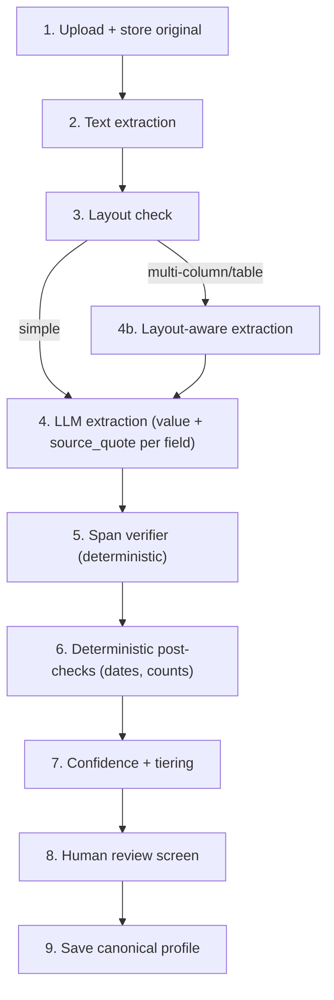

Each stage is its own module so we can test and swap them independently. Stages
2, 5, and 6 are pure deterministic code (no model) — that is where most of the
safety lives.

#### 1.11.2 Module breakdown

| Stage | Module | Type | Notes |
|-------|--------|------|-------|
| 1 | `intake/upload.ts` | code | Store raw file; detect duplicate re-import via content hash |
| 2 | `intake/extractText.ts` | code | PDF/DOCX/MD/TXT → normalized text + char index |
| 3 | `intake/detectLayout.ts` | code | Heuristic: is this multi-column/table-heavy? |
| 4 | `intake/extractProfile.ts` | LLM function | Returns value + source_quote per field |
| 4b | `intake/layoutExtract.ts` | LLM function | Render-to-image path for hard docs |
| 5 | `intake/verifySpans.ts` | code | The hallucination catcher (see 1.11.4) |
| 6 | `intake/postChecks.ts` | code | Date parsing, employer-count sanity |
| 7 | `intake/scoreAndTier.ts` | code | Assign confidence + field tier |
| 8 | UI review component | UI | Surface missing/low-conf/invented |
| 9 | `intake/saveProfile.ts` | code | Persist canonical profile + spans |

#### 1.11.3 The contract (Zod schema, source-of-truth)

We adopt a schema-first pattern: one Zod schema validates the LLM output, generates
the TypeScript types, and defines what we persist. Sketch:

```ts
// Each extracted field carries its value AND the verbatim source quote.
const ExtractedField = z.object({
  value: z.string(),
  source_quote: z.string(),        // verbatim substring the model used
  // filled in by our code, not the model:
  source_offset: z.number().nullable().default(null),
  verified: z.boolean().default(false),
  tier: z.enum(["critical", "important", "nice_to_have"]),
  confidence: z.number().min(0).max(1).default(0),
});

const ExperienceItem = z.object({
  employer: ExtractedField,
  title: ExtractedField,
  start_date: ExtractedField,
  end_date: ExtractedField,
  bullets: z.array(ExtractedField),
});

const ProfileExtraction = z.object({
  contact: z.object({ name: ExtractedField, email: ExtractedField, /* ... */ }),
  experience: z.array(ExperienceItem),
  education: z.array(/* ... */),
  skills: z.array(ExtractedField),
});
```

Field tiers are declared in the schema so the gating logic (1.11.6) is
data-driven, not hard-coded.

#### 1.11.4 Span verifier — the core of "build our own"

This is the module that turns hallucination into a deterministic check. For each
field the model returned:

```ts
function verifyField(field, sourceText) {
  const needle = normalizeWhitespace(field.source_quote);
  const hay = normalizeWhitespace(sourceText);
  const offset = hay.indexOf(needle);

  if (needle.length === 0 || offset === -1) {
    // The quote does not exist in the document → invented.
    return { ...field, verified: false, invented: true, source_offset: null };
  }
  // Optional stricter check: does field.value actually appear within / derive
  // from the quote? (e.g., a date value must be inside its quote)
  return { ...field, verified: true, invented: false, source_offset: offset };
}
```

Why this works: the most common and most dangerous failure (a fully fabricated
value) requires the model to also fabricate a `source_quote`, which then fails
`indexOf`. We catch it for free, deterministically, with zero model calls.

Known limits (we write these down so we understand the boundary):
- The model could quote real text that does not actually *support* the value
  (quote is real, but value is a misread). String matching won't catch that —
  that's a semantic check, deferred to the same idea as Fact Guard Layer B later.
- Fuzzy matching needed for light reformatting (smart quotes, hyphenation,
  line-break-split words). We normalize whitespace + punctuation before matching,
  and allow a bounded edit-distance fallback for near-misses, flagged as
  `low_confidence` rather than verified.

#### 1.11.5 Deterministic post-checks (stage 6)

Pure code, no model:
- **Date parsing:** every date field must parse to a normalized form (store both
  raw quote and parsed value). Unparseable → flag for review, never guess.
- **Chronology sanity:** start_date <= end_date; overlapping employment flagged
  (not blocked).
- **Employer-count cross-check:** count distinct employers found vs a quick
  regex/heuristic pass over the raw text; large mismatch → warn (possible layout
  loss).

#### 1.11.6 Gating logic (stage 7-8)

Data-driven from tiers:
- A `critical` field that is `invented` or `unverified` → blocks the profile from
  auto-becoming canonical; must go to the review screen.
- An `important` field unverified → surfaced as low-confidence, non-blocking.
- A `nice_to_have` field unverified → kept silently, marked low-confidence.

This is the field-priority-tier lesson made executable: we only hard-gate on the
critical tier.

#### 1.11.7 Layout detection + fallback (stage 3 / 4b)

Naive trigger heuristic for MVP (keep it simple, learn from it):
- Flag as "hard layout" if extracted text has many very short lines interleaved
  (column bleed), or the parser reports >1 text column, or table structures are
  detected.
- Hard layout → route to `layoutExtract.ts` (render page to image, extract with a
  vision-capable model). Use a standard render-and-verify technique for difficult document layouts.
- Start with the heuristic; if it misclassifies often, that misclassification is
  itself a documented learning and we refine.

#### 1.11.8 Build order for this component

1. `extractText.ts` + `upload.ts` (deterministic, testable immediately).
2. Zod schema + `extractProfile.ts` (the LLM call returning value + quote).
3. `verifySpans.ts` — write tests with planted fabrications; this is where we
   prove the approach.
4. `postChecks.ts` (dates, counts).
5. `scoreAndTier.ts` + review screen.
6. `detectLayout.ts` + `layoutExtract.ts` last (only the hard-case path).

We can write stages 1-4 with a golden set of a few resumes (including ones with
deliberately tricky dates and a two-column layout) before any UI exists.

#### 1.11.9 What we will measure as we build

Wire these from the start (they are the Component-1 benchmarks made concrete):
- invented-fields-per-resume (count of `invented: true`).
- critical-field verified rate.
- date-parse success rate.
- span-match rate before vs after whitespace/punct normalization (tells us how
  much the fuzzy fallback is doing).

## 2. Evidence Library / Evidence Curator

Status: Build-ready component note — second component.

### 2.1 Purpose

Turn unstructured source material (project notes, performance reviews, past
resumes, work summaries) into a library of small, reusable, grounded **evidence
items** and **project cards**. Each evidence item is a verified or
user-confirmed fact that can later back a resume bullet, cover-letter claim, or
interview answer. The library is the bridge between "raw history" and "claims we
are allowed to make," and it is where every fact gets tagged with confidence,
sensitivity, and allowed usage.

### 2.2 Where it fits

Second stage of the grounding spine. Consumes source documents (and the canonical
profile from Component 1). Produces the evidence set that Retrieval (Component 4)
selects from and that Fact Guard (Component 6) checks claims against. Nothing
external-facing should ever cite a fact that is not an approved evidence item.

### 2.3 Inputs and outputs

Input:
- Source documents (extracted text + layout hints).
- Canonical profile (for cross-referencing employers, dates, projects).
- Existing evidence library (to dedupe/merge against).

Output (sketch — to become `evidence.schema.json` and `project.schema.json`):
- `evidence_items[]`: { text, evidence_type, source_document_id, source_span,
  confidence, sensitivity_level, allowed_usage, related_project_id }.
- `project_cards[]`: { title, context, problem, role, actions, results, metrics,
  technologies, stakeholders, public_safe_summary, sensitivity_level }.
- `star_story_candidates[]`: structured behavioral stories built from evidence.
- `sensitivity_warnings[]`: flagged confidential terms needing review.
- `pending_status`: nothing becomes "approved" without user confirmation.

Controlled vocabularies (carried from design-doc):
- evidence_type: original | extracted | user_confirmed | inferred
- sensitivity_level: public_safe | private | sensitive
- allowed_usage: resume | interview | cover_letter | internal_only

### 2.4 Naive version (build first)

- Send each source document to one LLM call: "extract reusable achievements,
  metrics, and STAR stories as JSON."
- Save all returned items straight into the evidence library.
- Treat every extracted item as usable.

As before, this will look impressive and be quietly unsafe. We build it to expose
the specific ways it is unsafe.

### 2.5 Failure modes observed (the lesson)

- **Inferred facts promoted to confirmed.** The model turns "probably led" into
  "led," inventing seniority or ownership the source never stated. The dangerous
  part: it lands in the library looking identical to a real fact.
- **Invented metrics.** "Improved performance" becomes "improved performance by
  35%." Numbers are the highest-risk hallucination because they are the most
  persuasive on a resume.
- **Sensitivity blindness.** Internal client names, unreleased product codenames,
  and confidential metrics get extracted verbatim with no flag, then are eligible
  to flow into a public resume.
- **Duplicate/near-duplicate sprawl.** The same achievement extracted from three
  documents creates three slightly different evidence items, fragmenting the
  library and confusing later retrieval.
- **Lost provenance.** Without a source span per item, we can't verify the fact
  or let the user confirm it, and Fact Guard later has nothing to check against.

### 2.6 Hardened version

- **Evidence-type honesty.** Every item is tagged original/extracted/inferred.
  Inferred items are NEVER auto-promoted to confirmed — they require explicit
  user action. (This is the single most important rule of the component.)
- **Metric grounding.** Any numeric metric must carry the source span containing
  that number. A metric with no source number is rejected or downgraded to a
  question for the user ("Do you have a number for this?").
- **Sensitivity classification at extraction time.** Run a classifier + a
  deterministic blocked-terms pass over every item to set sensitivity_level and
  produce a public_safe_summary. Sensitive items are quarantined from
  external-facing usage until approved. (De-identification lives here as a
  step — see design-doc §9.3.3.)
- **Dedupe/merge.** Before insert, check semantic + keyword similarity against
  existing items; offer merge rather than creating near-duplicates.
- **Human approval gate.** Items enter as `pending`; the user approves, edits,
  rejects, or merges. Only approved items are retrievable for generation
  (PRD FR-015).
- **Provenance everywhere.** Same rule as Component 1: no item without a source
  span is auto-confirmed.

### 2.7 Learnings borrowed

- **Separate "confirmed" from "inferred" as a hard type, not a confidence score.**
  Borrowed from the broader grounding principle in our own design and from the
  resume-parsing lesson that invented content must be a tracked category. A low
  confidence number is too easy to ignore; a type that blocks auto-use is not.
- **Sensitivity is a first-class field set at creation, not a later filter.**
  Use a data-classification and centralized-authorization pattern: every entity carries access metadata, one authority decides visibility. Lesson: classify once at the source, carry the tag everywhere.
- **De-identification needs a deterministic blocked-terms layer, not only a
  model.** Model passes should be paired with deterministic checks. Lesson: a
  user-editable blocked-terms list is the reliable backstop; the model handles
  fuzzy cases.
- **STAR/behavioral structure is reusable methodology worth encoding as a skill.**
  Competency-based interview preparation structures stories around repeatable
  competencies; we encode our own `star-story-extraction` skill rather than
  ad-hoc prompting.

### 2.8 Benchmark to clear

- Inferred-fact mislabel rate (inferred items wrongly tagged confirmed): target 0
  on golden set.
- Invented-metric rate (metrics with no source number that still get saved):
  target 0.
- Sensitive-term leak into public_safe_summary: target 0 (100% block recall on
  golden set — same bar as Fact Guard Layer A).
- Duplicate rate after dedupe pass: measurably lower than naive; set a target
  once we see naive numbers.

### 2.9 Guardrails

- Inferred facts cannot become confirmed evidence without explicit user action
  (design-doc §9.3.2 guardrail).
- No numeric metric without a source span.
- Sensitive items are non-retrievable for external-facing generation until a
  non-skippable human approval clears them (design-doc §9.3.3).
- Every item retains its source_document_id and source_span.

### 2.10 Open questions

- Do project cards and evidence items share one table or two? (Design-doc models
  them separately; confirm for MVP.)
- Where does the blocked-terms list live and how does the user edit it — global
  per workspace, or per source document?
- Is de-identification run eagerly on every sensitive item, or lazily only when
  an item is about to be used externally? (Eager is safer; lazy is cheaper.)
- How do we represent a merge in the data model so provenance from all merged
  sources is retained?

### 2.11 Implementation Design (our own version)

Stack: TypeScript, local-first. Reuses the Component 1 patterns (Zod contract,
source-span verification, deterministic checks) and adds three new ideas:
evidence typing, sensitivity classification, and dedupe/merge.

#### 2.11.1 Pipeline overview

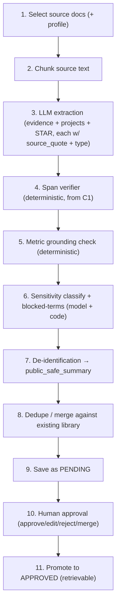

Stages 4, 5, and the blocked-terms half of 6 are deterministic code.

#### 2.11.2 Module breakdown

| Stage | Module | Type | Notes |
|-------|--------|------|-------|
| 2 | `evidence/chunk.ts` | code | Heading/paragraph-aware chunks + char index |
| 3 | `evidence/extract.ts` | LLM function | Items with value, source_quote, evidence_type, candidate metrics |
| 4 | `intake/verifySpans.ts` | code | Reused from Component 1 |
| 5 | `evidence/checkMetrics.ts` | code | Every numeric metric must appear in its source_quote |
| 6 | `evidence/classifySensitivity.ts` | model + code | Sets sensitivity_level; deterministic blocked-terms pass |
| 7 | `evidence/deidentify.ts` | LLM function | Produces public_safe_summary + redaction diff |
| 8 | `evidence/dedupe.ts` | code + embeddings | Similarity check; propose merge |
| 9-11 | `evidence/store.ts` + UI | code/UI | Pending → approved lifecycle |

#### 2.11.3 The contract (Zod sketch)

```ts
const EvidenceItem = z.object({
  text: z.string(),
  source_quote: z.string(),
  source_document_id: z.string(),
  source_offset: z.number().nullable().default(null),
  evidence_type: z.enum(["original", "extracted", "user_confirmed", "inferred"]),
  metrics: z.array(z.object({ value: z.string(), source_quote: z.string() })).default([]),
  sensitivity_level: z.enum(["public_safe", "private", "sensitive"]).default("private"),
  allowed_usage: z.array(z.enum(["resume","interview","cover_letter","internal_only"])),
  public_safe_summary: z.string().nullable().default(null),
  status: z.enum(["pending", "approved", "rejected"]).default("pending"),
  related_project_id: z.string().nullable().default(null),
});
```

#### 2.11.4 Metric grounding (the new deterministic check)

```ts
function checkMetric(metric, sourceText) {
  // Extract the numeric tokens from the claimed metric value.
  const numbers = extractNumbers(metric.value);          // e.g. ["35", "%"]
  const quoteHasAll = numbers.every(n => metric.source_quote.includes(n));
  const quoteInDoc = normalize(sourceText).includes(normalize(metric.source_quote));
  if (!quoteHasAll || !quoteInDoc) {
    return { ok: false, reason: "metric number not found in source" };
  }
  return { ok: true };
}
```

Lesson made executable: a number that does not appear in its own source quote is
the highest-risk fabrication; we reject or convert it into a question for the
user rather than store it.

#### 2.11.5 Sensitivity + de-identification

- **Blocked-terms (deterministic):** a user-maintained list per workspace (client
  names, codenames, unreleased products). Exact + case-insensitive match marks an
  item `sensitive` regardless of what the model thinks.
- **Classifier (model):** labels remaining items public_safe/private/sensitive
  for fuzzy cases the term list misses.
- **De-identification (model):** for sensitive items, produce a
  `public_safe_summary` and a **redaction diff** the user sees before approval.
- **Quarantine rule (deterministic):** an item with `sensitivity_level=sensitive`
  and no approved `public_safe_summary` is not retrievable for external usage.
  This is enforced in the retrieval filter (Component 4), not by trusting callers.

#### 2.11.6 Dedupe / merge

- On insert, embed the new item and compare (cosine) against existing items in the
  same workspace; also keyword-overlap check.
- Above a similarity threshold → present as a merge candidate, do not auto-merge.
- A merged item keeps an array of `source_document_id`/`source_span` so provenance
  from all sources is retained (answers the §2.10 merge question).

#### 2.11.7 Decisions taken (resolving §2.10 open questions)

- **Eager de-identification** for sensitive items (safer; aligns with the
  privacy-first calibration). Lazy is rejected.
- **Blocked-terms list is workspace-global**, user-editable in settings.
- **Projects and evidence are separate tables** (matches design-doc data model);
  evidence may reference a `related_project_id`.

#### 2.11.8 Build order

1. `chunk.ts` + `extract.ts` (reuse C1 span verifier immediately).
2. `checkMetrics.ts` with planted fake metrics in the golden set.
3. `classifySensitivity.ts` blocked-terms pass first (deterministic), classifier
   second.
4. `deidentify.ts` + redaction-diff UI.
5. `dedupe.ts` (needs embeddings — can stub with keyword-only until Component 4).
6. Pending→approved lifecycle + review UI.

#### 2.11.9 What we will measure

- inferred-mislabeled-as-confirmed count (target 0).
- ungrounded metrics stored (target 0).
- sensitive-term leak into public_safe_summary (target 0).
- merge precision (are proposed merges actually duplicates?) — observe, then set.

## 3. JD Analyst

Status: DRAFT — third component.

### 3.1 Purpose

Convert a pasted job description into a structured requirement matrix: hard
requirements, soft/preferred qualifications, keywords, role signals, and
interview implications. This is the "target" half of the matching problem — the
profile/evidence is what the user *has*, the JD analysis is what the role
*wants*. It must stay faithful to the JD (no invented requirements) and preserve
the original text as source.

### 3.2 Where it fits

Third stage of the grounding spine, first step of the Tailored Resume workflow.
Output feeds Retrieval (which evidence to pull) and Resume Tailor (what to
emphasize). Also feeds the match score and, later, Interview Coach.

### 3.3 Inputs and outputs

Input:
- Raw JD text (pasted) + optional company/title/level metadata.

Output (sketch — `jd-analysis.schema.json`):
- `requirements[]`: { text, requirement_type (hard|soft), importance, keywords[],
  source_quote }.
- `role_signals[]`: seniority cues, domain, scope hints.
- `keywords[]`: normalized skill/tool/domain terms for retrieval + ATS.
- `interview_implications[]`: topics this JD predicts will be probed.
- `original_jd_text`: preserved verbatim.

### 3.4 Naive version (build first)

- One LLM call: "extract requirements and keywords from this JD as JSON."
- Save the result.

### 3.5 Failure modes observed (the lesson)

- **Invented requirements.** The model adds "industry-standard" requirements the
  JD never states (e.g., "5+ years" when no number is given), which then warps
  tailoring and match scoring.
- **Hard/soft confusion.** "Nice to have" qualifications get promoted to hard
  requirements, making the user look less qualified than they are.
- **Keyword over-normalization.** "React.js" / "ReactJS" / "React" collapse
  inconsistently, breaking later ATS keyword coverage checks.
- **Lost source.** Without a source_quote per requirement, we can't show the user
  *why* a requirement was extracted or verify it.

### 3.6 Hardened version

- **Source_quote per requirement** (reuse the Component 1 verifier) — every
  extracted requirement must quote the JD; unquoted requirements are dropped.
- **Explicit hard/soft classification with rationale**, defaulting ambiguous
  cases to soft (conservative: never inflate what the role demands).
- **Keyword normalization table** — a deterministic alias map (React/ReactJS →
  react) so retrieval and ATS checks are consistent.
- **No external inference in MVP** — JD Analyst does not call company search; it
  works only from the JD text (design-doc §9.3.4). Keeps it a clean, testable
  function.

### 3.7 Learnings borrowed

- **Treat it as a typed LLM function, not an agent.** Single-pass structured
  parse needs no tool loop. Keeps cost/latency low.
- **Source-quote grounding generalizes.** The same anti-hallucination trick from
  Component 1 applies to JD parsing — invented requirements are caught the same
  deterministic way.
- **Keyword aliasing is a known ATS concern.** Recruiter/ATS tooling matches on
  surface keyword forms; a normalization map is the simple, deterministic fix.

### 3.8 Benchmark to clear

- Invented requirements (no source_quote in JD) stored: target 0 on golden set.
- Hard/soft misclassification rate: measure on golden set, set target after naive.
- Keyword normalization consistency: 100% of known aliases map correctly.

### 3.9 Guardrails

- Keep original JD text as source (design-doc §9.3.4).
- Do not infer requirements as facts unless clearly marked (and only as soft).
- No external calls in MVP.

### 3.10 Open questions

- Is the keyword alias map hand-seeded, or learned/extended over time?
- Do we compute the match score inside JD Analyst or as a separate step that
  joins JD analysis with retrieved evidence? (Leaning separate.)

### 3.11 Implementation Design (our own version)

#### 3.11.1 Pipeline

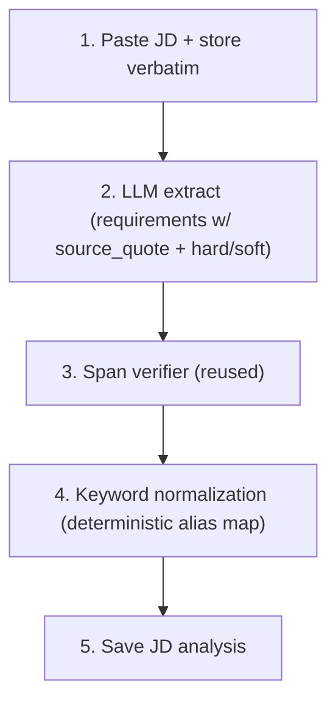

#### 3.11.2 Modules

| Stage | Module | Type |
|-------|--------|------|
| 1 | `jd/store.ts` | code |
| 2 | `jd/analyze.ts` | LLM function |
| 3 | `intake/verifySpans.ts` | code (reused) |
| 4 | `jd/normalizeKeywords.ts` | code |
| 5 | `jd/save.ts` | code |

#### 3.11.3 Contract (Zod sketch)

```ts
const Requirement = z.object({
  text: z.string(),
  source_quote: z.string(),
  requirement_type: z.enum(["hard", "soft"]),
  importance: z.number().min(0).max(1).default(0.5),
  keywords: z.array(z.string()).default([]),
  verified: z.boolean().default(false),
});
const JDAnalysis = z.object({
  original_jd_text: z.string(),
  requirements: z.array(Requirement),
  role_signals: z.array(z.string()).default([]),
  keywords: z.array(z.string()).default([]),
  interview_implications: z.array(z.string()).default([]),
});
```

#### 3.11.4 Keyword normalization

- Maintain `jd/aliasMap.ts`: `{ "reactjs": "react", "react.js": "react", ... }`.
- Hand-seed for MVP; extend as we observe misses (documented learning).
- Applied to both JD keywords and (later) evidence keywords so the match join in
  Component 5 compares like with like.

#### 3.11.5 Decisions taken

- Match score is computed **separately** (joins JD analysis + retrieved evidence),
  not inside JD Analyst — keeps this a pure function.
- Alias map is **hand-seeded** for MVP.

#### 3.11.6 Build order

1. `store.ts` + `analyze.ts` returning requirements with quotes.
2. Reuse span verifier; drop unquoted requirements.
3. `normalizeKeywords.ts` with a small seed alias map + tests.

#### 3.11.7 What we measure

- invented-requirement rate (target 0).
- hard/soft accuracy vs golden labels.
- alias-map hit rate.

## 4. Retrieval / Personal RAG

Status: DRAFT — fourth component.

### 4.1 Purpose

Given a need (e.g., "evidence relevant to these JD requirements"), return the
most relevant **approved, usage-eligible** evidence and profile sections. This is
the component that decides *what context the generators see*. Its correctness is
both a quality concern (good matches) and a safety concern (the eligibility
filter is what prevents internal_only/sensitive content from reaching a resume).

### 4.2 Where it fits

Fourth stage of the spine; called by Resume Tailor, and later by Interview Coach.
Reads the evidence library (Component 2). The eligibility filter here is the
enforcement point for the sensitivity rules Component 2 set.

### 4.3 Inputs and outputs

Input:
- A query context (JD requirements, or a topic).
- A retrieval policy (which index types, which sensitivity/usage allowed).

Output (`rag-result.schema.json`):
- `results[]`: { evidence_id, text, source_document_id, source_span, confidence,
  sensitivity_level, allowed_usage, relevance_score, reason_for_selection }.

### 4.4 Naive version (build first)

- Embed all evidence; embed the query; return top-k by cosine similarity.

### 4.5 Failure modes observed (the lesson)

- **Eligibility leak.** Pure similarity ignores sensitivity/usage — an
  internal_only item that is semantically perfect gets returned and could flow
  into a resume. **This is the dangerous one.**
- **Exact-term misses.** Vector search alone misses exact company/tool/metric
  matches that keyword search would nail.
- **Recency/strength blindness.** A weak old achievement outranks a strong recent
  one because they are semantically similar.
- **Over-retrieval.** Returning 20 loosely-related items dilutes the generator's
  context and raises cost.

### 4.6 Hardened version (hybrid retrieval)

Order matters — **filter before similarity**:
1. **Structured filter first (deterministic):** workspace_id, status=approved,
   sensitivity/usage eligibility for this policy. Ineligible items never enter
   the candidate set.
2. **Keyword match** for exact terms (companies, tools, metrics).
3. **Vector similarity** over the filtered candidates.
4. **Rank** by a blend: similarity + requirement importance + evidence confidence
   + recency + outcome strength.
5. **Cap** results to a small k with a reason_for_selection per item.

This matches design-doc §8.1 and the selected hybrid retrieval pattern.

### 4.7 Learnings borrowed

- **Filtering is the safety mechanism, not the vector math.** Based on the centralized authorization stance: eligibility is
  enforced before ranking, so a caller cannot accidentally surface restricted
  content.
- **Hybrid (structured + keyword + vector) beats vector-only.** Use a standard hybrid retrieval design: structured filters + keyword + vector search.
- **Single embeddings table with index_type for MVP.** Defer physically separate
  stores and reranking until volume needs them.

### 4.8 Benchmark to clear

- Eligibility leak rate (ineligible item appearing in results): target 0,
  enforced by test with planted internal_only items.
- Exact-term recall (does a known company/tool query retrieve the right item?):
  high target on golden set.
- Top-k relevance (human-judged): observe, then set.

### 4.9 Guardrails

- The eligibility filter is mandatory and runs first; no code path skips it.
- Results carry sensitivity/usage so downstream can double-check.
- internal_only is never eligible for external-facing generation policies.

### 4.10 Open questions

- pgvector vs an in-process/SQLite vector approach at single-user scale?
- Do we need reranking at MVP volume, or is the blended score enough? (Leaning
  enough.)
- How is the ranking blend weighted, and is it tunable per workflow?

### 4.11 Implementation Design (our own version)

#### 4.11.1 Pipeline

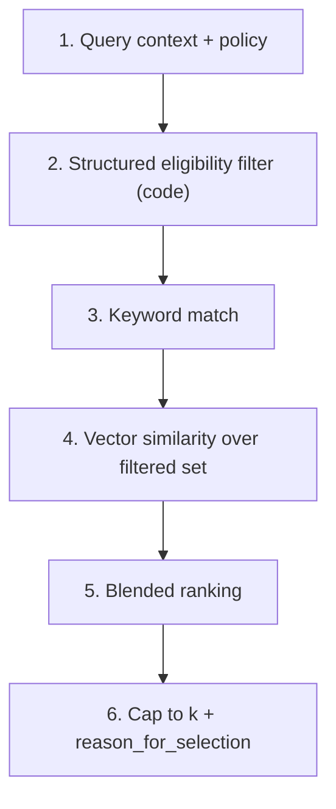

#### 4.11.2 Modules

| Stage | Module | Type |
|-------|--------|------|
| 2 | `rag/eligibilityFilter.ts` | code (safety-critical) |
| 3 | `rag/keywordMatch.ts` | code |
| 4 | `rag/vectorSearch.ts` | code + embeddings |
| 5 | `rag/rank.ts` | code |
| - | `rag/embeddings.ts` | code | shared embed util |

#### 4.11.3 Embeddings table (MVP)

One table: `{ id, workspace_id, index_type, source_entity_type, source_entity_id,
chunk_text, embedding, sensitivity_level, allowed_usage }`. Structured columns
let the eligibility filter run as a plain WHERE before any vector op.

#### 4.11.4 Eligibility filter (safety-critical)

```ts
function eligible(item, policy) {
  if (item.workspace_id !== policy.workspace_id) return false;
  if (item.status !== "approved") return false;
  if (policy.external_facing && item.sensitivity_level === "sensitive"
      && !item.public_safe_approved) return false;
  if (policy.external_facing && item.allowed_usage.includes("internal_only")) return false;
  return policy.allowed_usage.some(u => item.allowed_usage.includes(u));
}
```

Tested with planted internal_only/sensitive items that must never appear.

#### 4.11.5 Ranking blend

`score = w1*similarity + w2*importance + w3*confidence + w4*recency + w5*outcome`.
Weights in config, default hand-set. Tunable later; not learned in MVP.

#### 4.11.6 Decisions taken

- **Single embeddings table + index_type** (no separate stores).
- **No reranking** at MVP volume.
- Vector backend: start with pgvector locally; an in-process cosine fallback is
  acceptable if pgvector setup is heavy (documented either way).

#### 4.11.7 Build order

1. embeddings table + `embeddings.ts`.
2. `eligibilityFilter.ts` + tests with planted restricted items (prove safety).
3. `keywordMatch.ts`, then `vectorSearch.ts`.
4. `rank.ts` blend.

#### 4.11.8 What we measure

- eligibility leak (target 0).
- exact-term recall.
- retrieval latency (for our own awareness, not an OE dashboard).

## 5. Resume Tailor

Status: DRAFT — fifth component.

### 5.1 Purpose

Generate a role-specific resume draft for one job, using only approved evidence
and the canonical profile, and emit a **claim-to-evidence mapping** so every
generated bullet is traceable. This is the product's core value moment — but it
is also the highest hallucination risk, because generation is where the model is
most tempted to embellish.

### 5.2 Where it fits

Fifth stage of the spine. Consumes JD analysis (Component 3) + retrieved evidence
(Component 4) + profile (Component 1). Its output feeds Fact Guard (Component 6)
and HR Reviewer (Component 7), then render/export (Component 8).

### 5.3 Inputs and outputs

Input:
- Canonical profile, JD requirement matrix, retrieved approved evidence, a resume
  template.

Output (`tailored-resume.schema.json` + `generated-claim.schema.json`):
- `resume_json`: structured resume (sections, bullets).
- `resume_markdown`: human-readable form.
- `claims[]`: { claim_text, evidence_ids[], source_quotes[], section } — one per
  generated bullet/claim.
- `missing_evidence_questions[]`: gaps where the JD wants something the evidence
  doesn't support, surfaced as questions rather than invented.

### 5.4 Naive version (build first)

- One LLM call: "write a resume tailored to this JD using this profile."
- Render and show it.

### 5.5 Failure modes observed (the lesson)

- **Embellishment.** The model upgrades scope ("contributed to" → "led"), adds
  skills implied by the JD but not in evidence, or invents a metric. The resume
  reads great and is partly fiction.
- **No traceability.** A plain resume has no claim→evidence link, so Fact Guard
  has nothing to check and the user can't verify.
- **JD keyword stuffing.** The model crams JD keywords in unsupported ways to
  game ATS.
- **Identity drift.** Dates, employers, titles subtly change to fit the JD.

### 5.6 Hardened version

- **Evidence-bounded generation.** The agent is instructed it may only assert
  claims backed by provided evidence; for each bullet it must list the
  evidence_ids and their source_quotes it relied on. (This produces the mapping
  Fact Guard needs.)
- **Gaps become questions, not inventions.** When the JD wants X and no evidence
  supports it, emit a `missing_evidence_question` instead of fabricating.
- **Identity-preservation rule.** Employers/titles/dates are copied from the
  canonical profile, never regenerated.
- **It's an agent (multi-step + retrieval), but tightly bounded** — it may pull
  more evidence via Retrieval, but only eligible evidence (Component 4 enforces).

### 5.7 Learnings borrowed

- **Claim-to-evidence mapping is the trust differentiator.** Generation must emit
  provenance, not just text.
- **The generator should not be the validator.** Resume Tailor produces claims +
  mappings; a separate Fact Guard checks them. Never let the generator
  self-certify.
- **Surface gaps honestly.** Borrowed from the evidence-first principle — a
  visible "we don't have evidence for X" is more valuable (and safer) than a
  confident fabrication.

### 5.8 Benchmark to clear

- Claims without an evidence mapping: target 0 (every bullet maps to ≥1 evidence
  or is user-confirmed).
- Identity drift (changed employer/title/date vs profile): target 0 (also caught
  by Fact Guard A).
- JD keyword coverage: measured, but never at the cost of an unsupported claim.

### 5.9 Guardrails

- No new companies, degrees, dates, projects, skills, or metrics without evidence
  (design-doc §9.3.5).
- Every claim carries evidence_ids + source_quotes.
- Only eligible evidence may be used (enforced by Retrieval).

### 5.10 Open questions

- Resume template: how configurable in MVP (one clean template vs several)?
- Do we let the user pre-select which evidence to emphasize, or fully delegate to
  retrieval+tailor?

### 5.11 Implementation Design (our own version)

#### 5.11.1 Pipeline

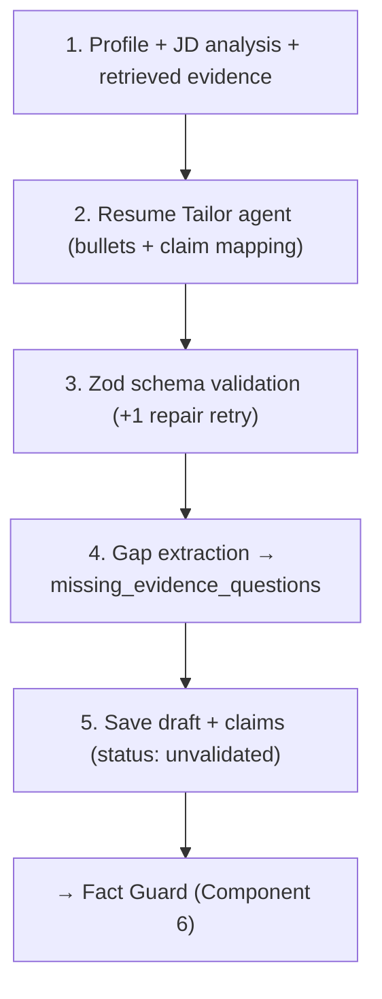

The draft is explicitly `unvalidated` until Fact Guard runs — Resume Tailor never
marks its own output trustworthy.

#### 5.11.2 Modules

| Stage | Module | Type |
|-------|--------|------|
| 2 | `tailor/generate.ts` | agent (strong model) |
| 3 | `tailor/validateSchema.ts` | code (Zod + repair) |
| 4 | `tailor/extractGaps.ts` | code |
| 5 | `tailor/saveDraft.ts` | code |

#### 5.11.3 Contract (Zod sketch)

```ts
const GeneratedClaim = z.object({
  claim_text: z.string(),
  section: z.string(),
  evidence_ids: z.array(z.string()),     // must be non-empty OR user_confirmed
  source_quotes: z.array(z.string()),
  support_status: z.enum(["unvalidated","supported","partially_supported",
                          "unsupported","user_confirmed"]).default("unvalidated"),
});
const TailoredResume = z.object({
  resume_json: z.any(),                  // structured sections
  resume_markdown: z.string(),
  claims: z.array(GeneratedClaim),
  missing_evidence_questions: z.array(z.string()).default([]),
});
```

#### 5.11.4 Schema-repair policy (reused project-wide)

On Zod validation failure: one bounded repair retry feeding the validation error
back to the model; second failure saves the raw draft and marks the step failed
(`partially_succeeded`). This is the runtime contract from design-doc §6.4.

#### 5.11.5 Decisions taken

- MVP ships **one clean, ATS-friendly template**; multiple templates deferred.
- Retrieval drives evidence selection; a "pin this evidence" user override is a
  nice-to-have, deferred.

#### 5.11.6 Build order

1. `generate.ts` producing bullets + claim mapping (mapping is mandatory output).
2. `validateSchema.ts` with the repair retry.
3. `extractGaps.ts`.
4. Wire to Fact Guard before exposing export.

#### 5.11.7 What we measure

- claims-without-mapping (target 0).
- identity-drift count (target 0).
- gaps surfaced vs fabricated (we plant JD asks with no evidence and confirm they
  become questions).

## 6. Fact Guard (Layer A deterministic + Layer B semantic)

Status: DRAFT — sixth component. The trust spine.

### 6.1 Purpose

Validate a generated document's claims against the profile and evidence. **Layer
A** (deterministic code) hard-blocks high-impact fabrications and sensitive-term
leaks. **Layer B** (model) judges fuzzy semantic support and warns. Together they
turn "trust the model" into "verify, then trust."

### 6.2 Where it fits

Sixth stage, gate between Resume Tailor and HR Reviewer/export. Also runs in the
claim-revalidation workflow whenever evidence changes.

### 6.3 Inputs and outputs

Input:
- Generated document + its claims (with evidence_ids/source_quotes), canonical
  profile, approved evidence set, blocked-terms list.

Output:
- Per-claim: support_status + risk_level + (for blocks) reason.
- `blocking_violations[]`, `warnings[]`.
- Updated claim ledger entries (status, last_validated_at).

### 6.4 Naive version (build first)

- One LLM call: "check this resume against this evidence and list unsupported
  claims."

### 6.5 Failure modes observed (the lesson)

- **Non-determinism.** The same resume yields different verdicts across runs — you
  cannot gate on that, and you cannot regression-test it.
- **Shared blind spots.** A model checking a model misses the same invented
  metric both produced.
- **Silent high-impact passes.** A fabricated employer/degree/date slips through
  because the checker "found it plausible."

### 6.6 Hardened version — two layers

**Layer A (deterministic code, hard block):**
- Extract high-impact entities from the generated doc: employers, titles, dates,
  degrees, certifications, numeric metrics, plus blocked terms.
- Diff against the profile + approved evidence entity sets.
- Block on any net-new high-impact entity or any blocked-term hit.
- Mark dependent claims stale on evidence change (revalidation).

**Layer B (model, warn only):**
- For each claim, judge semantic support against its linked evidence
  (supported / partial / unsupported) with confidence.
- Cannot override a Layer A block; produces warnings + evidence-gap suggestions.

Note (honesty about the boundary, from §1.11.4): the *decision* in Layer A is
deterministic, but extracting entities from free text may itself need a
constrained model step feeding the deterministic comparator. We will build the
pure-code extractor first, measure where it misses (date/name variants), and add
a constrained-extraction front-end only if recall demands it — and document that
as a learning.

### 6.7 Learnings borrowed

- **Split deterministic blocking from model judgment.** Pair deterministic checks
  with model passes. Blocking must be reproducible and testable.
- **Numbers and identity are the high-risk set.** Metrics, dates, and employers
  are where fabrication hurts most, so they are exactly Layer A's hard-block set.
- **100% block recall is the bar for safety-critical checks.** This follows the
  eval strategy in design-doc §19.3.

### 6.8 Benchmark to clear

- Sensitive-term block recall: 100% on golden set.
- High-impact unsupported claim block recall: 100% on golden set.
- Layer A determinism: identical input → identical output, 100% (by construction).
- Layer B agreement with human judgment on fuzzy cases: observe, then set.

### 6.9 Guardrails

- Layer A blocks cannot be overridden by Layer B.
- A blocked high-impact claim stops finalization unless the user explicitly
  confirms via a controlled flow (design-doc §9.3.7).
- All blocks/warnings are written to the claim ledger and audit log.

### 6.10 Open questions

- How much entity extraction can be pure code before we need a constrained model
  front-end? (We will discover this empirically.)
- Confirmation flow UX for a user who legitimately wants to assert something the
  evidence doesn't yet contain (it should route back to add evidence, not bypass).

### 6.11 Implementation Design (our own version)

#### 6.11.1 Pipeline

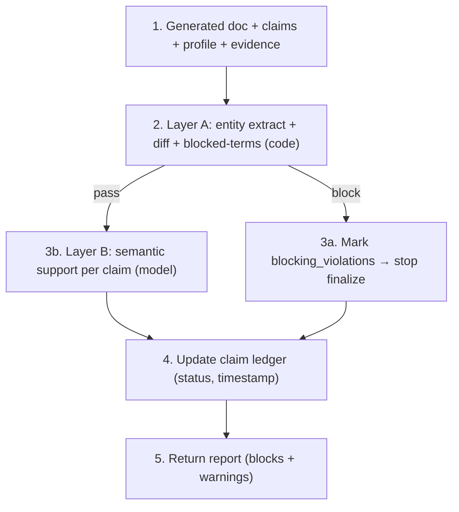

#### 6.11.2 Modules

| Stage | Module | Type |
|-------|--------|------|
| 2 | `factguard/extractEntities.ts` | code (later: + constrained model) |
| 2 | `factguard/diffEntities.ts` | code |
| 2 | `factguard/blockedTerms.ts` | code |
| 3b | `factguard/semanticSupport.ts` | LLM function |
| 4 | `factguard/ledger.ts` | code |

#### 6.11.3 Layer A diff (core)

```ts
function layerA(doc, profile, evidence, blockedTerms) {
  const docEntities = extractEntities(doc);          // employers, dates, degrees, metrics
  const known = buildKnownSet(profile, evidence);
  const violations = [];
  for (const e of docEntities.highImpact) {
    if (!known.has(normalizeEntity(e))) violations.push({ type: "net_new", entity: e });
  }
  for (const term of blockedTerms) {
    if (docContains(doc, term)) violations.push({ type: "blocked_term", term });
  }
  return violations;   // non-empty → block finalization
}
```

Tested with a golden set of resumes carrying planted fake employers, altered
dates, invented metrics, and sensitive terms — all must be caught (100%).

#### 6.11.4 Decisions taken

- Build the **pure-code entity extractor first**; add a constrained-model
  front-end only if measured recall on date/name variants is insufficient
  (explicit learning checkpoint).
- Layer B is **warn-only** and never gates by itself.

#### 6.11.5 Build order

1. `blockedTerms.ts` (simplest, highest safety value).
2. `extractEntities.ts` + `diffEntities.ts` with planted-fabrication golden set.
3. `ledger.ts` (status + timestamps; powers revalidation).
4. `semanticSupport.ts` (Layer B) last.

#### 6.11.6 What we measure

- block recall for sensitive terms and high-impact fabrications (target 100%).
- Layer A determinism (by construction).
- Layer A entity-extraction recall on variant-heavy golden cases (the learning
  metric that decides whether we add the constrained-model front-end).

## 7. HR Reviewer (with fairness)

Status: DRAFT — seventh component.

### 7.1 Purpose

Evaluate a validated resume from a recruiter/hiring-manager perspective and
return advisory, uncertainty-aware feedback: a score, strengths, weaknesses,
suggested edits, a 10-second-scan assessment, and ATS notes — all filtered
through a fairness rubric that refuses to penalize protected/proxy signals. It
advises; it does not assert hiring outcomes, and it does not rewrite.

### 7.2 Where it fits

Seventh stage, after Fact Guard passes. Output is feedback shown to the user, not
a gate. Runs only on validated resumes (so it never praises a fabricated bullet).

### 7.3 Inputs and outputs

Input:
- Validated tailored resume, JD analysis, claim-evidence mapping.

Output (`resume-review.schema.json`):
- `score` + `scope_note` (what the rubric covers/doesn't) + `confidence`.
- `strengths[]`, `weaknesses[]`, `suggested_edits[]`.
- `ten_second_scan`, `ats_notes`.
- `fairness_check`: result of the do-not-penalize screen.

### 7.4 Naive version (build first)

- One LLM call: "act as a recruiter and score this resume; list red flags."

### 7.5 Failure modes observed (the lesson)

- **Biased red flags.** The naive recruiter persona penalizes employment gaps,
  career changes, graduation year (age proxy), non-traditional education — exactly
  the discriminatory heuristics we must not encode.
- **Overconfident assertions.** "You will be rejected because X" — stated as fact
  when recruiter behavior is variable and context-specific.
- **Scope creep into rewriting.** The reviewer rewrites bullets, blurring the line
  between review and generation (and re-introducing hallucination risk).
- **Generic advice.** One-size rubric gives shallow, role-agnostic feedback.

### 7.6 Hardened version

- **Fairness rubric as a hard part of the skill.** A do-not-penalize list
  (employment gaps, career changes, parental/medical/caregiving leave,
  non-traditional education, age-correlated signals, immigration/location unless
  user-stated). The reviewer may note "a recruiter might ask about X; prepare an
  explanation" but never frames these as disqualifiers.
- **Advisory language enforced.** Output uses hedged, uncertainty-aware phrasing;
  a `confidence` and `scope_note` are required fields.
- **Review-only.** It suggests edits as suggestions; it never returns a rewritten
  resume.
- **Role/seniority-segmented rubric** via the skills system (versioned).

### 7.7 Learnings borrowed

- **Fairness must be designed in, not retrofitted.** This is a domain/legal
  concern, first-class.
- **Recruiter advice is probabilistic; frame it that way.** The HR Reviewer label
  overpromises unless calibrated with confidence and scope.
- **Encode methodology as a versioned skill.** Narrow, curated skills beat broad
  docs; `hr-screening-review` carries the
  rubric, red flags, ATS checklist, and fairness rules.

### 7.8 Benchmark to clear

- Fairness controlled-variant test: resumes differing only in gap/age/education
  signals must not diverge in score on those signals alone (design-doc §19.3).
- Assertion-language check: no disqualifying-as-fact phrasing (lint the output).
- Review-only: zero rewritten resumes returned.

### 7.9 Guardrails

- Do-not-penalize list enforced (design-doc §9.3.6).
- Advisory, uncertainty-aware language; confidence + scope_note required.
- Never rewrites; suggestions only.

### 7.10 Open questions

- How is the fairness controlled-variant test set built (who authors the paired
  resumes)?
- Role-family segmentation granularity for MVP (one general rubric vs a few
  families)?

### 7.11 Implementation Design (our own version)

#### 7.11.1 Pipeline

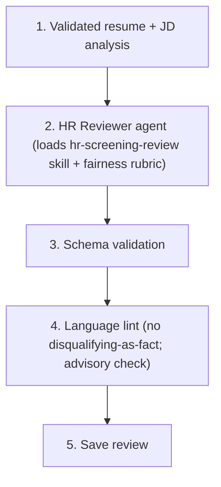

#### 7.11.2 Modules

| Stage | Module | Type |
|-------|--------|------|
| 2 | `hr/review.ts` | agent (strong model) |
| - | `skills/hr-screening-review/SKILL.md` | skill (incl. fairness rubric) |
| 3 | `hr/validateSchema.ts` | code |
| 4 | `hr/languageLint.ts` | code |
| 5 | `hr/save.ts` | code |

#### 7.11.3 Fairness rubric (in the skill)

Do-not-penalize list + allowed/disallowed framing examples are authored directly
into `SKILL.md` (mirrors design-doc §12.3). The skill is versioned so the rubric
can evolve and be tested.

#### 7.11.4 Language lint (deterministic backstop)

A small checker flags disqualifying-as-fact patterns ("you will be rejected",
"too old", "gap is a problem") so a biased phrasing can't ship even if the model
slips. Cheap, deterministic, and a documented safety net.

#### 7.11.5 Decisions taken

- MVP uses **one general rubric + seniority awareness**; role-family segmentation
  deferred.
- Fairness controlled-variant pairs are authored as part of the golden set.

#### 7.11.6 Build order

1. `SKILL.md` with fairness rubric.
2. `review.ts` + schema.
3. `languageLint.ts` + the controlled-variant fairness test.

#### 7.11.7 What we measure

- fairness controlled-variant divergence (target: none on protected signals).
- assertion-language violations (target 0 after lint).

## 8. Document Render / Export (+ visual validation loop)

Status: DRAFT — eighth component, closes the grounding spine.

### 8.1 Purpose

Render the canonical resume JSON into faithful, well-formatted output
(Markdown, plain text, PDF) using a deterministic renderer — not LLM-generated
layout — and verify the rendered result is correct via a visual self-check loop.
This is what the user actually downloads, so fidelity to the validated content is
paramount.

### 8.2 Where it fits

Final stage of the spine, after HR Reviewer. Consumes the validated resume_json.
No model is involved in layout; the only model use is the optional visual
verification read.

### 8.3 Inputs and outputs

Input:
- Validated `resume_json` + chosen template + format.

Output:
- Rendered files (md/txt/pdf) + `export_uris`.
- `render_validation`: structural + visual check result.

### 8.4 Naive version (build first)

- Ask the LLM to "produce the resume as formatted PDF/HTML."

### 8.5 Failure modes observed (the lesson)

- **LLM layout drift.** Letting the model produce layout reintroduces content
  changes (it "improves" wording while formatting) — undoing Fact Guard.
- **Silent structural breakage.** Generated HTML/PDF has overlapping text, dropped
  sections, or broken bullets that text checks miss.
- **Format inconsistency.** The PDF and the Markdown disagree because they were
  generated separately.

### 8.6 Hardened version

- **Deterministic renderer from JSON.** One template engine maps resume_json →
  output. Content cannot change at render time because the renderer doesn't
  generate language. (design-doc §14.3)
- **Single canonical source.** All formats derive from the same resume_json, so
  they cannot disagree.
- **Visual validation loop.** Render PDF → image → a vision model checks
  structural correctness (all sections present, no overlap, bullets intact). If
  it fails, fix the renderer/template, not the content. (Borrowed file-reader
  technique.)
- **Structural assertions (deterministic).** Code checks every resume_json section
  appears in the rendered text, counts bullets, verifies no content was dropped.

### 8.7 Learnings borrowed

- **Never let an LLM own layout for a fidelity-critical doc.** Determinism
  preserves the validated content.
- **Rendered-output self-check.** Render, read back as image, evaluate, and fix.
  Use a standard render-and-verify technique for visual output validation.
- **One canonical source, many renders.** Standard separation-of-content-and-
  presentation; here it is also a safety property.

### 8.8 Benchmark to clear

- Content fidelity: rendered text contains 100% of resume_json content (no drops,
  no additions), checked deterministically.
- Visual structural check pass rate on golden resumes: high target.
- Format agreement: md/txt/pdf carry identical content.

### 8.9 Guardrails

- No model generates layout or rewrites content during render.
- Structural assertion must pass before an export is offered for download.
- Exports of content with unresolved Fact Guard warnings require user approval
  (design-doc §17.5).

### 8.10 Open questions

- Which renderer for high-quality PDF (the design-doc's open Q1)? Candidate:
  HTML+CSS → headless print, or a typeset library.
- Is the visual validation loop on by default, or only when structural assertions
  are ambiguous? (Leaning: structural always, visual on-demand to save cost.)

### 8.11 Implementation Design (our own version)

#### 8.11.1 Pipeline

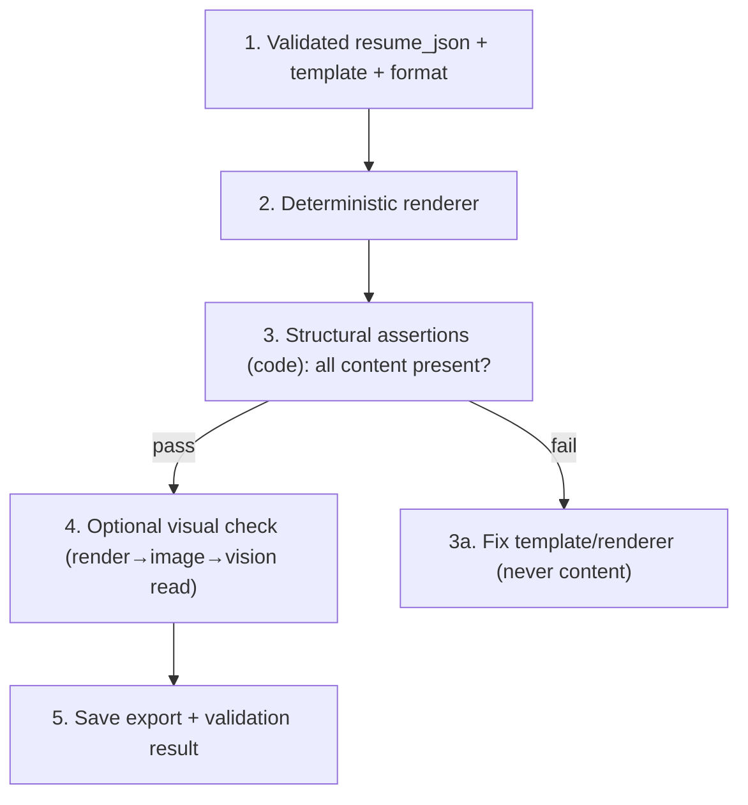

#### 8.11.2 Modules

| Stage | Module | Type |
|-------|--------|------|
| 2 | `render/renderResume.ts` | code (template engine) |
| 3 | `render/structuralCheck.ts` | code |
| 4 | `render/visualCheck.ts` | LLM function (vision), optional |
| 5 | `render/save.ts` | code |

#### 8.11.3 Structural check (deterministic)

Walk resume_json; assert each field's text appears in the rendered output;
count bullets per section vs source; flag any drop/addition. This is the cheap,
always-on fidelity guarantee.

#### 8.11.4 Visual check (borrowed loop)

Render to image, ask a vision model "are all sections present, any overlapping or
cut-off text, are bullets intact?" Fix is always to the template/renderer, never
the content (content is frozen post-Fact-Guard).

#### 8.11.5 Decisions taken

- **Structural check always on; visual check on-demand** (cost-aware, within
  personal scope).
- Renderer approach: HTML+CSS → headless print for PDF (revisit design-doc Q1).
- All formats derive from one resume_json.

#### 8.11.6 Build order

1. `renderResume.ts` (Markdown + text first — simplest, no layout risk).
2. `structuralCheck.ts` with content-presence assertions.
3. PDF rendering.
4. `visualCheck.ts` last (the self-correcting loop).

#### 8.11.7 What we measure

- content-fidelity violations (target 0).
- visual structural pass rate.
- cross-format content agreement (target 100%).

---

## Grounding spine complete (Components 1-8)

The eight components above form the complete, buildable grounding spine: import a
resume → build evidence → analyze a JD → retrieve eligible evidence → tailor a
resume with claim mappings → fact-check (deterministic + semantic) → HR review
with fairness → render and export with fidelity checks. Each is designed
functionally complete (no critical correctness step dropped) and within
personal-project scope (no prod/OE machinery).

## 9. Interview Coach

Status: DRAFT — ninth component, first post-spine.

### 9.1 Purpose

Generate an interview preparation pack for a specific job: likely questions,
project-specific follow-up chains, behavioral answer plans grounded in evidence,
knowledge gaps, and a practice checklist. It reuses the spine's grounding
discipline — sample answers must trace to evidence, not be invented.

### 9.2 Where it fits

First post-spine component. Consumes JD analysis (C3), the tailored resume (C5),
retrieved evidence (C4), and optionally company research (C11). Output feeds the
Interview Review loop (C10) and updates the interview growth profile.

### 9.3 Inputs and outputs

Input:
- JD analysis, tailored resume + claim mappings, retrieved evidence, optional
  company research, prior interview growth profile.

Output (`interview-prep-pack.schema.json`):
- `likely_questions[]`: { question, why_predicted, linked_requirement }.
- `project_followups[]`: per project, a chain of deepening questions.
- `behavioral_answers[]`: STAR-structured answers with `evidence_ids`.
- `knowledge_gaps[]`, `practice_checklist[]`.

### 9.4 Naive version (build first)

- One LLM call: "generate likely interview questions and sample answers for this
  resume and JD."

### 9.5 Failure modes observed (the lesson)

- **Invented sample answers.** The model writes a confident STAR story using
  achievements the user never had — the same hallucination risk as resume
  tailoring, now in spoken form.
- **Generic questions.** Without grounding in the specific resume/JD, questions
  are textbook and low-value.
- **No follow-up depth.** Real interviews drill down; a flat question list doesn't
  prepare the user for "and how did you handle X when Y failed?"
- **Unprioritized.** Everything is "important," so the user can't focus.

### 9.6 Hardened version

- **Evidence-grounded answers.** Behavioral answers must cite `evidence_ids`; an
  answer with no backing evidence becomes a prompt ("draft an answer — do you
  have an example of X?") rather than a fabricated story.
- **Project follow-up chains.** For each project, generate a depth chain
  (what → how → trade-offs → failure handling → result) so the user rehearses
  drill-downs.
- **Prediction rationale.** Each question links to the JD requirement or resume
  bullet that predicts it, so the user understands *why*.
- **Reuse Fact Guard on sample answers.** Run Fact Guard (C6) over generated
  answers to flag unsupported claims (design-doc §10.4 already routes prep through
  Fact Guard).

### 9.7 Learnings borrowed

- **Competency-mapped, STAR-structured questions** — use common
  competency-based interview-prep structure, reframed candidate-side.
- **Grounding extends to spoken answers** — a fabricated interview story is as
  risky as a fabricated bullet.
- **Encode as a `behavioral-interview-coach` skill** — keep the methodology
  narrow and curated.

### 9.8 Benchmark to clear

- Behavioral answers without evidence backing: target 0 (become prompts instead).
- Question relevance (human-judged) vs naive baseline: higher.
- Each question carries a prediction rationale: 100%.

### 9.9 Guardrails

- Sample answers grounded in evidence (design-doc §9.3.10).
- Run Fact Guard on generated answers; unsupported claims flagged.

### 9.10 Open questions

- Is company research required before prep, or optional/on-demand? (Leaning
  optional in MVP — C11 is later.)
- How does the growth profile feed back into question selection?

### 9.11 Implementation Design (our own version)

#### 9.11.1 Pipeline

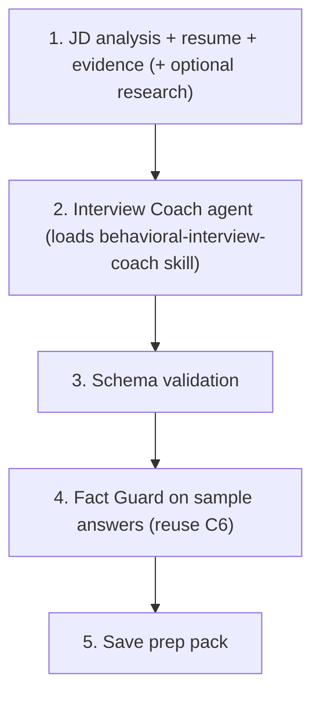

#### 9.11.2 Modules

| Stage | Module | Type |
|-------|--------|------|
| 2 | `interview/coach.ts` | agent (strong model) |
| - | `skills/behavioral-interview-coach/SKILL.md` | skill |
| 3 | `interview/validateSchema.ts` | code |
| 4 | `factguard/*` | code+model (reused) |
| 5 | `interview/savePack.ts` | code |

#### 9.11.3 Decisions taken

- Company research is **optional/on-demand** in MVP.
- Behavioral answers reuse the C6 Fact Guard rather than a separate checker.

#### 9.11.4 Build order

1. `SKILL.md` (question prediction + STAR + follow-up chain rules).
2. `coach.ts` + schema.
3. Wire Fact Guard over answers.

#### 9.11.5 What we measure

- ungrounded sample answers (target 0).
- question relevance vs naive.

## 10. Interview Review

Status: DRAFT — tenth component.

### 10.1 Purpose

Turn an interview transcript or notes into structured improvement: separate
content/knowledge gaps from communication gaps, produce concrete action items,
and update the interview growth profile. The discipline here is honesty — it must
not invent interviewer feedback the user didn't report.

### 10.2 Where it fits

After an interview. Consumes the transcript/notes, the job workspace, the prep
pack (C9), and the resume. Updates the growth profile that feeds future C9 runs.

### 10.3 Inputs and outputs

Input:
- Transcript or notes, job workspace, prep pack, resume.

Output (`interview-review.schema.json`):
- `knowledge_gaps[]`, `communication_gaps[]` (kept separate).
- `action_items[]`: concrete, time-bound.
- `growth_profile_update`: deltas to strengths/weaknesses.

### 10.4 Naive version (build first)

- One LLM call: "review this interview and list what went well and badly."

### 10.5 Failure modes observed (the lesson)

- **Invented feedback.** The model asserts "the interviewer felt your answer was
  weak" when the notes never said that — fabricated judgment.
- **Conflating gap types.** Mixing "I didn't know the algorithm" (knowledge) with
  "I rambled" (communication) produces unfocused advice.
- **Vague actions.** "Practice more" instead of "rehearse 3 system-design answers
  by Friday."

### 10.6 Hardened version

- **Grounded in reported content only.** Reviews must reference what the
  transcript/notes actually contain; inferred interviewer sentiment is marked as
  inference, never stated as fact.
- **Two-axis separation.** Knowledge gaps vs communication gaps are distinct
  output arrays with distinct remediation.
- **Concrete, time-bound action items.**
- **Growth profile as an append-only learning record** that C9 reads next time.

### 10.7 Learnings borrowed

- **Do not invent feedback** — borrowed from design-doc §9.3.10 guardrail and our
  grounding principle.
- **Separate content from delivery** — a standard coaching distinction; encoded so
  remediation is targeted.
- **Append-only growth profile** — a simple longitudinal-learning pattern.

### 10.8 Benchmark to clear

- Invented-feedback rate: target 0 (planted transcripts with no sentiment must not
  yield asserted sentiment).
- Gap-type separation accuracy vs golden labels.
- Action items that are concrete + time-bound: target 100%.

### 10.9 Guardrails

- No invented interviewer feedback (design-doc §9.3.10).
- Inference is labeled as inference.

### 10.10 Open questions

- Transcript intake: free text only, or structured by question?
- How are growth-profile deltas merged/decayed over many interviews?

### 10.11 Implementation Design (our own version)

#### 10.11.1 Pipeline

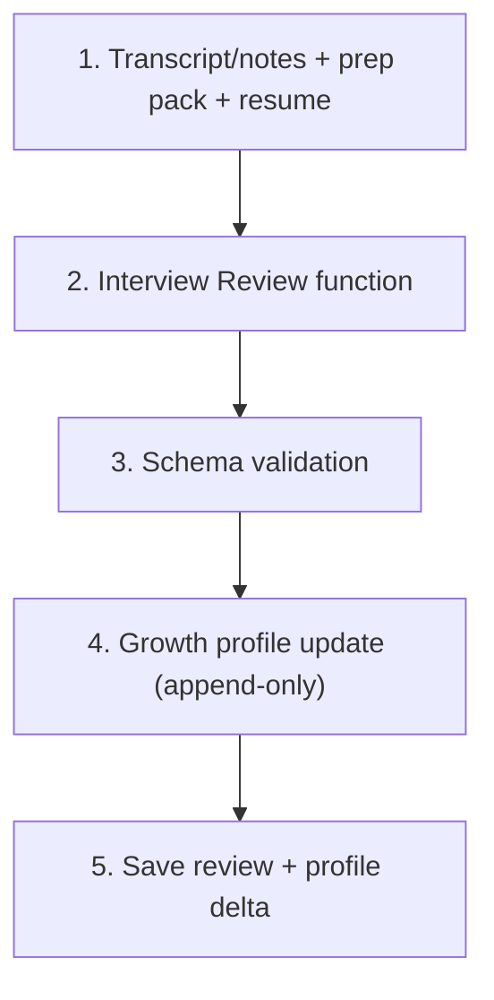

#### 10.11.2 Modules

| Stage | Module | Type |
|-------|--------|------|
| 2 | `interview/review.ts` | LLM function (strong) |
| 3 | `interview/validateReview.ts` | code |
| 4 | `interview/growthProfile.ts` | code |

#### 10.11.3 Decisions taken

- Transcript intake accepts **free text** in MVP; structured-by-question deferred.
- Growth profile is **append-only**; weighting/decay deferred.

#### 10.11.4 Build order

1. `review.ts` + schema (two-axis output).
2. Invented-feedback test with neutral transcripts.
3. `growthProfile.ts` append.

#### 10.11.5 What we measure

- invented-feedback rate (target 0).
- gap-type separation accuracy.

## 11. Company Research

Status: DRAFT — eleventh component. First external-search component.

### 11.1 Purpose

Gather public company and interview context (business summary, products,
interview themes) from external sources, always with citations, freshness, and
confidence labels — and never presenting anecdotal reports as fact. This is the
first component that crosses the external boundary, so source discipline is the
whole game.

### 11.2 Where it fits

Optional input to Interview Coach (C9). Standalone "research this company" action.
Uses external search + page fetch — the first place MCP-style tool boundaries
genuinely earn their place.

### 11.3 Inputs and outputs

Input:
- Company, role, location, optional interview round.

Output (`company-research.schema.json`):
- `company_summary`, `product_notes[]`.
- `interview_themes[]` (each labeled official vs anecdotal).
- `sources[]`: { url, title, domain, published_date, retrieved_date,
  source_type, credibility_score, snippet }.
- `confidence_labels` separating fact from inference.

### 11.4 Naive version (build first)

- One LLM call with web search: "tell me about interviewing at company X."

### 11.5 Failure modes observed (the lesson)

- **Anecdote-as-fact.** A single forum post becomes "Company X always asks Y."
- **No citations.** Claims can't be verified or aged.
- **Stale data.** Last year's process presented as current.
- **Fabricated specifics.** The model invents named interviewers or exact rounds.

### 11.6 Hardened version

- **Citations mandatory.** Every claim carries source links; uncited claims are
  dropped (deterministic check, like the source-quote rule but for URLs).
- **Source credibility scoring.** Official site/press > reputable news >
  community/anecdotal; type and score stored per source.
- **Official vs anecdotal separation.** Interview themes are labeled; anecdotal
  items are framed as "some candidates report," never as fact.
- **Freshness metadata.** Published/retrieved dates stored and surfaced.

### 11.7 Learnings borrowed

- **Citation + confidence + freshness is the external-research contract** —
  store source metadata and credibility for every research claim.
- **Encode as a `company-research` skill** with a credibility rubric.
- **MCP boundary is justified here** — external search and page fetch are genuine
  cross-boundary tools that need permissioning and logging.

### 11.8 Benchmark to clear

- Uncited claims in output: target 0 (deterministic citation check).
- Anecdotal-labeled-as-official: target 0 on golden set.
- Source freshness present for every source: 100%.

### 11.9 Guardrails

- Cite sources; separate official from anecdotal (design-doc §9.3.9).
- Do not claim private interview processes as fact.
- Respect source ToS/robots/rate limits.

### 11.10 Open questions

- Which search provider/abstraction (kept behind our own interface)?
- Do we persist fetched sources or expire them (design-doc open Q7)?

### 11.11 Implementation Design (our own version)

#### 11.11.1 Pipeline

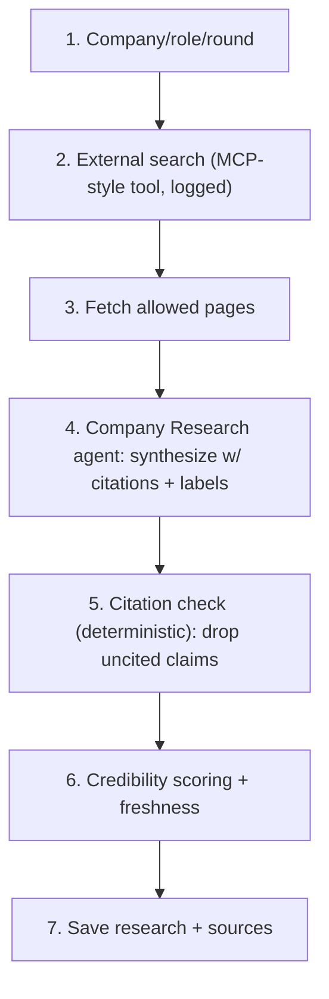

#### 11.11.2 Modules

| Stage | Module | Type |
|-------|--------|------|
| 2 | `research/search.ts` | tool (our own search interface) |
| 3 | `research/fetch.ts` | tool (ToS/robots-aware) |
| 4 | `research/synthesize.ts` | agent (strong model) |
| 5 | `research/citationCheck.ts` | code |
| 6 | `research/credibility.ts` | code |
| 7 | `research/save.ts` | code |

#### 11.11.3 Citation check (deterministic, the external analog of source-quote)

Every claim must reference at least one source URL present in the fetched set;
claims with no resolvable source are dropped or downgraded to "unverified." Mirrors
the spine's quote-verification discipline, applied to external facts.

#### 11.11.4 MCP note

This is where an MCP boundary is warranted (search, fetch are external, need
permission/logging). For MVP we keep our own tool interface with call logging; we
adopt the MCP *shape* without standing up a separate server unless/until we add
more external integrations.

#### 11.11.5 Decisions taken

- Search behind **our own interface** (provider-swappable), with call logging.
- Sources **persisted** for the workspace in MVP (revisit expiry later).

#### 11.11.6 Build order

1. `search.ts` + `fetch.ts` (ToS-aware) behind our interface.
2. `synthesize.ts` + schema with citation/label fields.
3. `citationCheck.ts` (drop uncited) + `credibility.ts`.

#### 11.11.7 What we measure

- uncited-claim rate (target 0).
- anecdotal-mislabel rate.
- source-freshness coverage.

## 12. Job Scout

Status: DRAFT — twelfth component. Heaviest external-boundary component.

### 12.1 Purpose

Find and rank relevant job postings against the user's profile/strategy, with a
match rationale, risk notes, and source URLs — while respecting source ToS,
robots, and rate limits. This is the most legally/technically sensitive component
because it touches third-party job sources.

### 12.2 Where it fits

Standalone discovery action; recommendations can spawn a job workspace (C3+).
Uses external search and job-source access — the external boundary at its widest.

### 12.3 Inputs and outputs

Input:
- User preferences (role, level, location, constraints), profile summary,
  target-role strategy.

Output (`job-recommendation.schema.json`):
- `recommendations[]`: { title, company, url, match_reasons[], risk_notes[],
  fit_score, source }.
- Deduplicated, with explanation per item.

### 12.4 Naive version (build first)

- One LLM call with search: "find jobs matching this profile."

### 12.5 Failure modes observed (the lesson)

- **ToS/robots violations.** Naive scraping hits prohibited pages or rate limits.
- **Fabricated/stale postings.** The model invents a posting or surfaces a closed
  one without a verifiable URL.
- **Biased ranking.** Fit scoring can steer users away from roles on proxy signals
  (same fairness risk as HR Reviewer).
- **Duplicate sprawl.** The same job from three aggregators appears thrice.

### 12.6 Hardened version

- **ToS-aware access only.** Respect robots/rate limits; only fetch allowed pages;
  a posting must have a resolvable URL to be shown.
- **Fairness in ranking.** Apply the same do-not-penalize rubric as HR Reviewer to
  fit scoring; never down-rank on proxy signals.
- **Dedup with explanation.** Consolidate duplicates; each recommendation carries
  match reasons + risk notes.
- **No fabricated postings.** Every recommendation maps to a fetched source
  (citation-check discipline from C11).

### 12.7 Learnings borrowed

- **Respect source terms; verifiable URLs only** — required by the
  external-boundary discipline.
- **Fairness applies to ranking, not just review** — the
  `job-recommendation-ranking` skill carries the fairness rubric.
- **Citation discipline prevents fabricated postings.**

### 12.8 Benchmark to clear

- Postings without a resolvable URL: target 0.
- ToS/robots violations: target 0 (enforced by the fetch layer).
- Fairness: ranking stable across proxy-only differences (same test as C7).
- Duplicate rate after dedup: measurably low.

### 12.9 Guardrails

- Respect source terms and rate limits; do not scrape prohibited pages
  (design-doc §9.3.11).
- Fairness rubric in ranking.
- Every recommendation has a verifiable source URL.

### 12.10 Open questions

- Which job sources are legally/technically acceptable (design-doc open Q8)? This
  needs a deliberate allowlist, not "search everything."
- Browser clipping (extension vs in-app) for manual capture (design-doc open Q9)?

### 12.11 Implementation Design (our own version)

#### 12.11.1 Pipeline

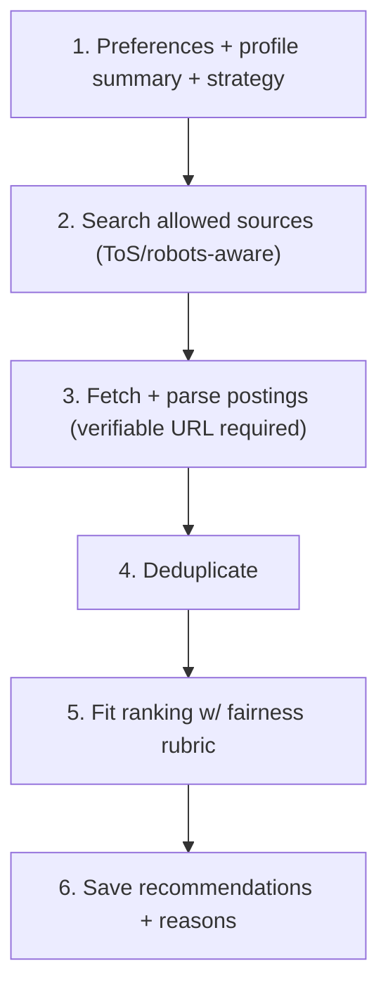

#### 12.11.2 Modules

| Stage | Module | Type |
|-------|--------|------|
| 2 | `scout/search.ts` | tool (allowlist-bound) |
| 3 | `scout/fetchPosting.ts` | tool (ToS-aware) |
| 4 | `scout/dedupe.ts` | code+embeddings |
| 5 | `scout/rank.ts` | agent/function + fairness skill |
| 6 | `scout/save.ts` | code |

#### 12.11.3 Source allowlist (correctness + legal)

A deliberate, configured allowlist of acceptable sources (e.g., specific
career-site/ATS patterns), not open-web scraping. The fetch layer refuses
anything outside it. This is a functional/legal requirement, not optional.

#### 12.11.4 Decisions taken

- **Allowlist-bound sources only** in MVP; expand deliberately.
- Browser clipping deferred (manual paste/JD-import covers MVP).
- Fit ranking reuses the fairness rubric from C7.

#### 12.11.5 Build order

1. `search.ts` + `fetchPosting.ts` against a tiny allowlist.
2. `dedupe.ts`.
3. `rank.ts` with fairness rubric + the fairness test.

#### 12.11.6 What we measure

- postings-without-URL (target 0).
- ToS/robots violations (target 0).
- fairness ranking stability.

## 13. Pipeline Tracker

Status: DRAFT — thirteenth component. Closes the set.

### 13.1 Purpose

Detect application updates from connected signals (email, calendar) and *suggest*
status changes — read-only by default, with user approval required before any
status change, and never sending email. It classifies and proposes; the human
decides.

### 13.2 Where it fits

Background/scheduled (or manual) sync. Reads email/calendar via a permissioned
boundary; writes only suggestions until the user approves (design-doc §10.5).

### 13.3 Inputs and outputs

Input:
- Recruiting-related emails, existing applications, optional calendar events.

Output (`status-suggestion.schema.json`):
- `suggestions[]`: { application_id, suggested_status, confidence, evidence_email,
  reason }.
- `follow_up_reminders[]`.

### 13.4 Naive version (build first)

- One LLM call over the inbox: "update my application statuses."

### 13.5 Failure modes observed (the lesson)

- **Auto-writing state.** The naive version changes statuses without consent — the
  worst outcome for a tracker the user must trust.
- **Misclassification.** A marketing email reads as a rejection; an interview
  invite is missed.
- **Privacy overreach.** Reading more of the mailbox than needed; logging raw
  email bodies.
- **Sending email.** Any outbound action is unacceptable here.

### 13.6 Hardened version

- **Read-only, suggest-only.** It never changes a status; it proposes, the user
  approves (design-doc §9.3.13).
- **Classifier + rules, not an agent.** Recruiting-email classification is a typed
  call; matching to an application is deterministic rules (sender/company/thread).
- **Least-privilege + redacted logging.** Minimal scope; trace logs reference
  email IDs, never raw bodies (design-doc §18.2 trace-privacy).
- **No send, ever.** No outbound capability exists in the component.

### 13.7 Learnings borrowed

- **Read-only default + human approval for state changes.**
- **Classifier, not agent** — classification needs no multi-step loop.
- **Redact PII at log time.**
- **MCP boundary for email/calendar** — external accounts need scoped, logged,
  revocable access.

### 13.8 Benchmark to clear

- Auto-applied status changes without approval: target 0 (by construction).
- Recruiting-email classification accuracy vs golden inbox.
- Raw email body in logs: target 0 (redaction test).

### 13.9 Guardrails

- Read-only by default; user approval before status changes; no email sending
  (design-doc §9.3.13).
- Least-privilege scopes; redacted logging.

### 13.10 Open questions

- Email scopes sufficient for classification (design-doc open Q5)?
- Connect-account UX and token handling (kept minimal/local for MVP)?

### 13.11 Implementation Design (our own version)

#### 13.11.1 Pipeline

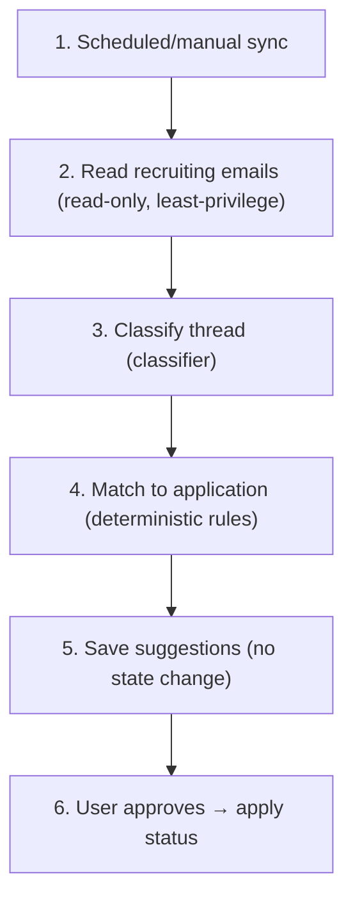

#### 13.11.2 Modules

| Stage | Module | Type |
|-------|--------|------|
| 2 | `tracker/readEmail.ts` | tool (read-only, scoped) |
| 3 | `tracker/classify.ts` | classifier (cheap model) |
| 4 | `tracker/matchApplication.ts` | code (rules) |
| 5 | `tracker/saveSuggestions.ts` | code |
| 6 | UI approval + `tracker/applyStatus.ts` | UI + code |

#### 13.11.3 Safety by construction

`applyStatus.ts` is the ONLY module that writes a status, and it is only callable
from the user-approval action — the classifier/matcher have no write path. There
is no email-send module at all. Safety is enforced by what code exists, not by
prompt instructions.

#### 13.11.4 Decisions taken

- **Suggest-only**; the write path is physically separated and user-gated.
- **No send capability** is built.
- Trace logs store email IDs, not bodies.

#### 13.11.5 Build order

1. `classify.ts` against a golden labeled inbox (no account needed — use fixtures).
2. `matchApplication.ts` rules.
3. `saveSuggestions.ts` + approval UI + `applyStatus.ts`.
4. Real email read-only connection last.

#### 13.11.6 What we measure

- unapproved status changes (target 0, by construction).
- classification accuracy.
- raw-body-in-logs (target 0).

---

## All components drafted (1-13)

The full component set is now designed: the grounding spine (1-8) plus the
post-spine components (9-13). Components 9-10 reuse the spine's grounding
discipline for interviews; 11-13 cross the external boundary (search, email,
job sources) where citation discipline, ToS-awareness, fairness in ranking, and
read-only/suggest-only safety become the dominant learnings.

Cross-cutting learnings that recur across components:
- Source grounding (quote for internal facts, citation for external facts) is the
  universal anti-hallucination tool.
- Deterministic code owns the safety-critical decisions; models handle fuzzy
  judgment.
- Safety enforced by what code exists (separated write paths, mandatory filters),
  not by trusting prompts.
- Fairness applies anywhere we score or rank a person or their opportunities.
- Build naive first to find the failure, then harden with the borrowed lesson.

Source-learning notes are intentionally excluded from the project doc set. This
file records only the implementation decisions needed to build the product.


---

## Skills & MCP Plan (reusable across components)

This section records which **skills** (reusable instruction packs) and **MCP
servers** (external-boundary tools) we build, and when. It follows two general
design lessons:

- "Use a skill to teach the agent something; build an MCP server only when the
  agent needs to *do* something it cannot already do."
- Skills should be **narrow, hand-curated, and progressively disclosed** (YAML
  frontmatter loads first; full body loads when relevant). Skill quality, not
  quantity, drives results.

### Skills (build these — most of our value is here)

Stored under `skills/<name>/SKILL.md` with the format: YAML frontmatter
(name, description, version, applies_to_component) + body (purpose/trigger, hard
rules, methodology, output contract, examples, failure modes, evaluation rubric).

| Skill | Component(s) | Status | Notes |
|-------|--------------|--------|-------|
| `resume-tailoring` | C5 | **Created** | Evidence-bounded rewrite + claim mapping + gap questions |
| `hr-screening-review` | C7 | **Created** | Recruiter review + fairness rubric (do-not-penalize) |
| `jd-analysis` | C3 | Planned | Requirement extraction rules, hard/soft classification, keyword aliasing |
| `project-deidentification` | C2 | Planned | Sensitive-term categories, public-safe rewrite, forbidden disclosures |
| `star-story-extraction` | C2, C9 | Phase 3 | STAR/CAR frameworks, competency mapping (competency-based interview-prep structure) |
| `behavioral-interview-coach` | C9 | Phase 3 | Question prediction, follow-up chains, evidence-grounded answers |
| `company-research` | C11 | Phase 5 | Source credibility rubric, citation rules, official vs anecdotal |
| `job-recommendation-ranking` | C12 | Phase 5 | Fit scoring + fairness rubric + explanation format |

Reuse note: `resume-tailoring` and `hr-screening-review` are used on every
tailored resume, so they are the highest-leverage skills and were built first.
The fairness rubric authored into `hr-screening-review` is reused by
`job-recommendation-ranking` (same do-not-penalize list).

### MCP servers (defer — only at the external boundary)

For the single-process local MVP, the "tools" the spine needs (document parse,
evidence read, resume render) are **in-process modules, not MCP servers**. MCP
earns its place only when we cross to genuinely external accounts/services in
Phase 5, where permissioning, logging, and revocable scopes matter.

| MCP server | Component(s) | When | Why MCP (then) |
|------------|--------------|------|----------------|
| (none) document parse / render | C1, C8 | MVP | In-process module; no cross-boundary, no MCP |
| (none) personal-data access | C1-C8 | MVP | In-process; same process owns the DB |
| `web-search` / `company-research` | C11 | Phase 5 | External calls need logging + rate-limit + ToS control |
| `job-search` | C12 | Phase 5 | Third-party sources need ToS/robots-aware, allowlisted access |
| `email` (read-only) | C13 | Phase 5 | External account; least-privilege scopes, audit logging |
| `calendar` (read + approved writes) | C13 | Phase 5 | External account; approval-gated writes |

Principle: we adopt the MCP *shape* (permissioned, logged tool boundary) but do
not stand up servers until there is a real external boundary to justify the
protocol. Until then, an in-process tool interface with call logging is enough.

### Why no MCP for the spine (the reusable lesson)

The spine never leaves our own process or touches a third party — it reads our
own DB, calls the model provider, and writes files. A protocol boundary there
would add serialization and a server to run for zero benefit. This is the
practical form of "skill vs MCP": teach methodology with skills (reusable now),
add MCP only for capabilities we genuinely cannot perform in-process (Phase 5).

