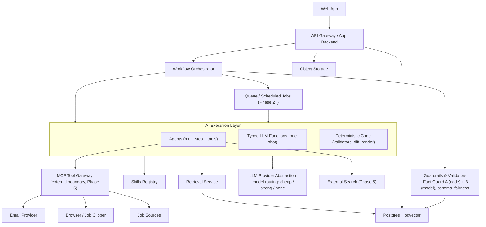
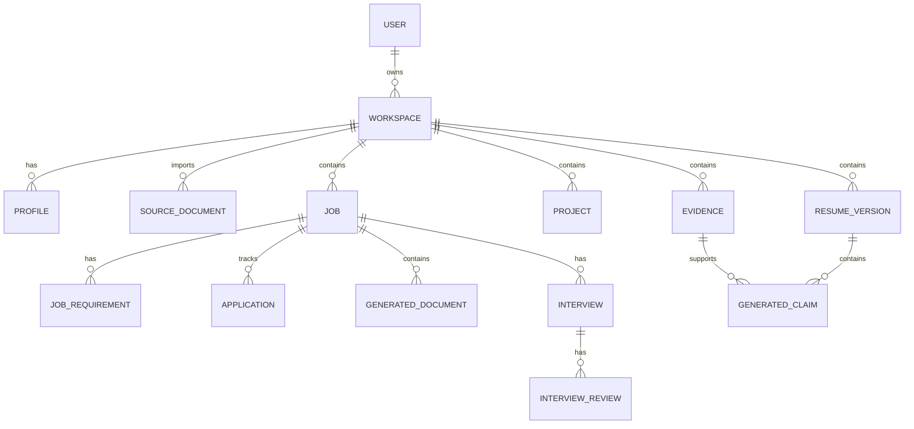
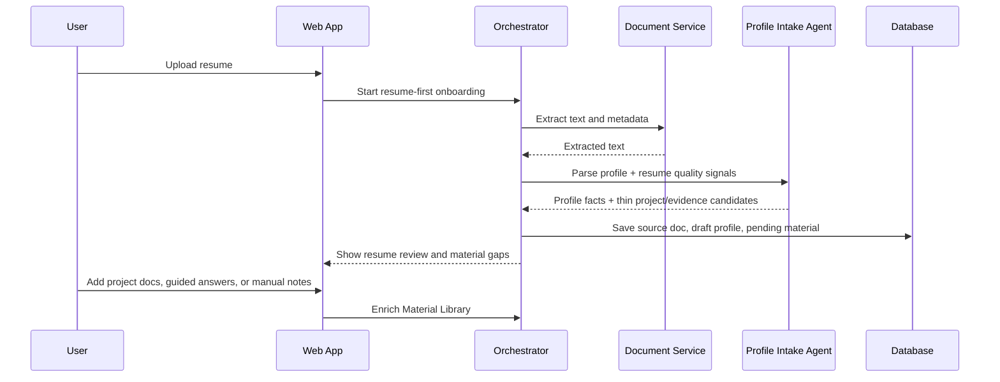
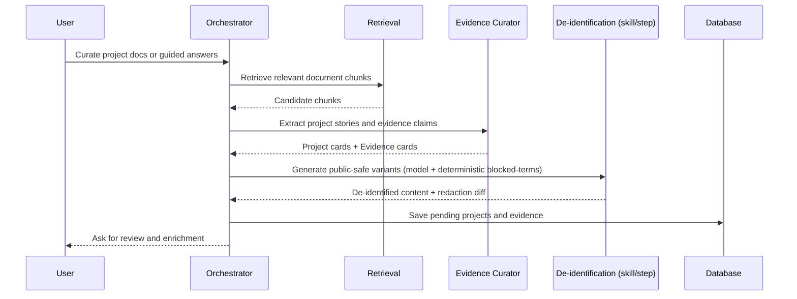
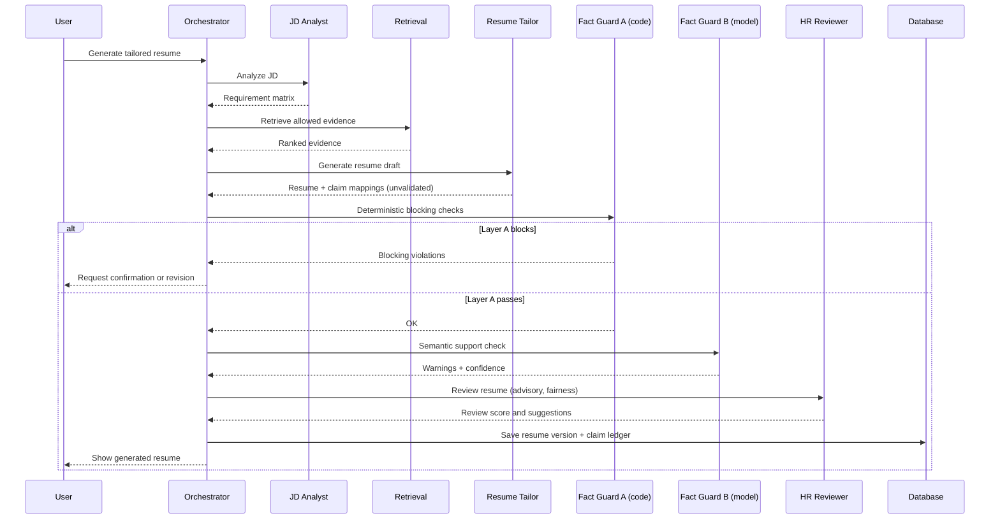
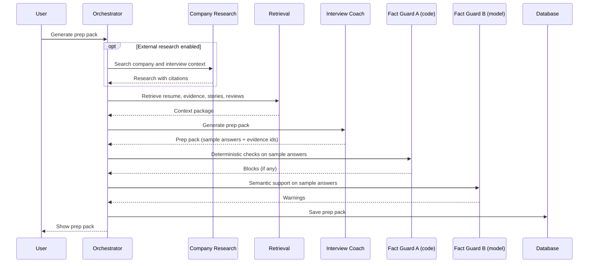
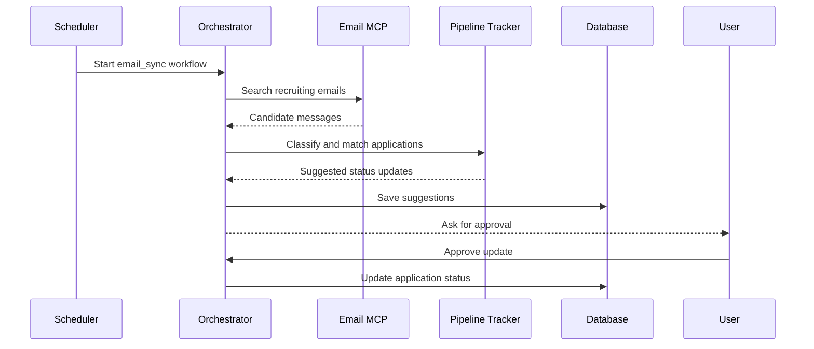
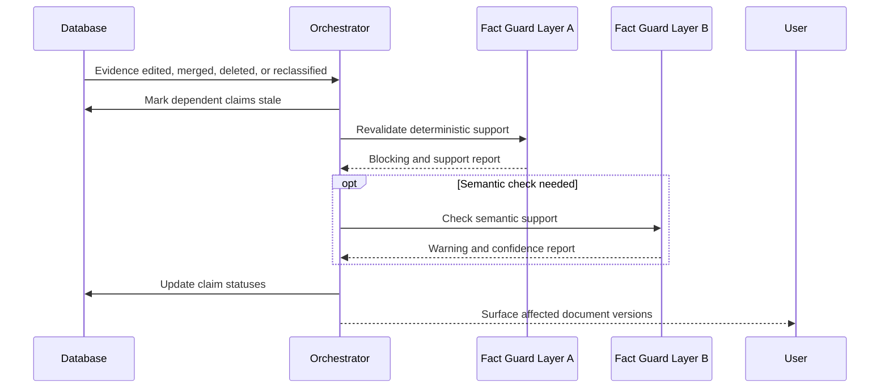

# Job Search Copilot Design Doc

Version: 0.5  
Status: Revised - career-ops pattern adoption added  
Date: 2026-06-09  
Related documents: prd.md, build-and-learn.md, skills/, src/schemas/ (see §1A)  

## Changelog

- v0.6 — Signed off JobDesk Final Project Reference UI v1 from Figma Make as
  the target product IA and visual reference. Clarified implementation
  constraints: Figma is a reference, not a source-code import target; current
  backend contracts and real feature readiness remain authoritative for staged
  implementation.
- v0.5 — Adopted selected career-ops patterns in JobDesk-native form:
  role archetype detection, posting-legitimacy assessment, canonical application
  statuses, interview story bank direction, scanner liveness checks, and
  user/system data ownership boundaries. No new skills are required for this
  revision; existing JD analysis, company research, job recommendation, and
  STAR story skills cover the methodology boundary.
- v0.4 — Project artifacts expanded: added `skills/` (13 versioned SKILL.md packs)
  and `src/schemas/` (canonical Zod data contracts + SETUP.md, JSON Schema
  generated). Updated §1A authority table to include skills and schemas.
- v0.3 — Reconciled with the companion-document set. Added §1A (Companion
  Documents & Authority). Added a pointer at §9 directing component-level
  implementation detail to build-and-learn.md. Updated stale diagrams: §4
  high-level architecture (agents/functions/code split, two-layer Fact Guard,
  Phase 5 external boundary), §10.2 (De-identification as skill/step), §10.3 and
  §10.4 (explicit Fact Guard Layer A → Layer B).
- v0.2 — Incorporated architecture review: deterministic + model Fact Guard
  split, agent collapse to ~5-6 true agents, fairness layer, claim-evidence
  ledger, local-first deployment, TypeScript end-to-end, cost/model routing.
- v0.1 — Initial technical architecture draft.

## 1. Executive Summary

This document proposes the technical architecture for Job Search Copilot, an AI-powered job search workspace that helps users prepare resumes, manage personal evidence, tailor applications, prepare for interviews, discover jobs, and track outcomes.

The recommended architecture is:

> Deterministic workflow orchestration + specialized agents + personal RAG + external search + MCP tool layer + versioned skills.

The product should not rely on free-form multi-agent conversation as the main control plane. Instead, the application should own the workflow state, permissions, data model, tool execution, and validation. Agents should be specialized workers with clear contracts, structured outputs, and narrow tool permissions.

## 1A. Companion Documents & Authority

This design doc anchors a multi-artifact project set. To avoid duplication and
drift, each artifact has one job and is authoritative for its area. When they
appear to overlap, defer to the "authoritative for" column.

| Artifact | Single job | Authoritative for |
|----------|------------|-------------------|
| `prd.md` | Product: what & why | Requirements, scope, personas, success metrics |
| `design-doc.md` (this) | System-level architecture | Data model, security/privacy, APIs, deployment, evaluation strategy, cross-cutting design, the component list & system-level contract |
| `architecture.md` | Diagram-first companion to this doc | Consolidated visual view (layers, spine, ledger, deployment); no authority of its own — mirrors this doc |
| `build-and-learn.md` | Per-component build + learning | Each component's pipeline, naive→hardened design, build order, benchmarks |
| `skills/<name>/SKILL.md` | Versioned methodology packs | The instructions/rubrics each agent/function follows (13 skills) |
| `src/schemas/*.ts` + `SETUP.md` | Canonical data contracts (Zod) | Authoritative shape of profile/evidence/JD/claim data; JSON Schema is generated from these |

Rule of thumb: this doc owns the *whole-system* view; `build-and-learn.md` owns
the *inside of each component*; `skills/` own the *methodology* a component
applies; `src/schemas/` own the *data contracts*. They should not duplicate each
other — this doc keeps the system-level contract (type, model tier, tools,
blocking authority); implementation detail lives in `build-and-learn.md`, and the
concrete field-level contracts live in `src/schemas/`.

## 2. Design Goals

DG1. Build a reliable job search workspace rather than a loose chat interface.

DG2. Ensure generated materials are grounded in verified user evidence.

DG3. Support job-specific resume and interview workflows.

DG4. Allow external search for jobs, company research, and public interview material.

DG5. Make tool integrations safe, auditable, and permissioned.

DG6. Keep the system extensible through modular agents, tools, and skills.

DG7. Support a gradual path from local-first MVP to production cloud deployment.

## 3. Non-Goals

NG1. Fully autonomous job application submission in MVP.

NG2. Unrestricted agent access to user email, browser, or filesystem.

NG3. Unvalidated natural-language-only outputs for critical artifacts.

NG4. Training custom foundation models in the initial product.

NG5. Building a general-purpose agent platform independent of the job search product.

## 4. Recommended High-Level Architecture



Notes: document parsing/rendering is an in-process module for the MVP, not an MCP
server (MCP earns its place at the external boundary in Phase 5 — email, search,
job sources). See `build-and-learn.md` for the per-component execution detail.

### 4.1 Key Architectural Choice

The app should own orchestration. Agents should not decide the entire workflow on their own.

Example:

For "Generate tailored resume":

1. Application creates a workflow run.
2. JD Analyst Agent produces structured requirements.
3. Retrieval service fetches relevant evidence.
4. Resume Tailor Agent generates a draft.
5. Fact Guard validates claims.
6. HR Reviewer scores the draft.
7. Application saves resume version and warnings.
8. User reviews and exports.

This is safer than asking a single autonomous agent to "do everything."

### 4.2 Accepted Architecture Review Decisions

The v0.1 review recommended reducing agent surface area and moving high-risk validation into deterministic code. The next architecture draft accepts the following decisions:

1. Component collapse: use roughly 5-6 true agents. One-shot extraction, parsing, classification, and validation tasks should be typed LLM functions, deterministic code, or skills.
2. Fact Guard split: deterministic code owns hard blocking checks. Model-based checks provide semantic support warnings and confidence.
3. Deployment stance: MVP is personal/local-first and cloud-ready. The production design may later evolve into hybrid or SaaS.
4. Runtime language: TypeScript end-to-end for MVP. Add Python only for specific document, ML, or evaluation dependencies.
5. Retrieval scope: use one embedding table scoped by `workspace_id` and `index_type` for MVP. Preserve logical index policies, but defer physically separate vector stores and reranking.
6. Fairness: HR review and job recommendation workflows must include fairness rubrics and regression tests.
7. Cost control: every model-based component must declare a model tier and budget.
8. Job quality filter: JD analysis must include a posting-legitimacy assessment so users can prioritize real, active, high-fit opportunities.
9. Canonical pipeline vocabulary: application tracking uses shared statuses (`evaluated`, `applied`, `responded`, `interview`, `offer`, `rejected`, `discarded`, `skip`) rather than free-form status text.

## 5. Suggested Technology Stack

### 5.1 MVP Stack

Frontend:
- Next.js.
- React.
- TypeScript.
- Tailwind CSS.
- shadcn/ui or equivalent component system.

Backend:
- Next.js API routes or a TypeScript backend service for MVP.
- PostgreSQL.
- pgvector.
- Redis for queues and transient locks.
- Object storage for uploaded files.

AI:
- OpenAI Responses API or Agents SDK for agent runs.
- Structured output schemas for critical artifacts.
- Embeddings for personal RAG.
- Web search provider for external company/job/interview research.
- TypeScript-first provider abstraction for model routing and local/user-key mode.

Document processing:
- PDF text extraction.
- DOCX parsing.
- Markdown canonical storage.
- PDF/DOCX export for resumes.

### 5.2 Production Stack Recommendation

Frontend:
- Next.js application.

Backend services:
- App API service: user, workspace, CRUD, auth, billing if needed.
- Agent service: workflow execution and agent runtime.
- Retrieval service: chunking, embeddings, hybrid search, reranking.
- Integration service: OAuth, email, calendar, browser/job source connectors.
- Document service: parsing and rendering.

Infrastructure:
- PostgreSQL + pgvector.
- Redis + BullMQ, Celery, or equivalent job queue.
- S3/R2/Supabase Storage.
- Observability stack: logs, traces, metrics.
- Secret manager for OAuth tokens and model keys.

Runtime note:
- Keep TypeScript as the default orchestration and agent runtime for MVP.
- Add a Python worker only when required by a specific PDF, DOCX, ML, evaluation, or NLP dependency.

## 6. Core Services

### 6.1 Web App

Responsibilities:
- Main workspace UI.
- Profile editor.
- Evidence library.
- Job workspace.
- Resume/document editor.
- Interview prep viewer.
- Application tracker.
- Dashboard.
- Approval modals for sensitive actions.

The UI should expose the AI workflow as explicit actions, not as hidden magic.

Examples:
- "Analyze JD"
- "Generate tailored resume"
- "Run fact check"
- "Create interview prep pack"
- "Search public interview material"
- "Approve email-derived status update"

### 6.1A Signed-Off Product UI Reference

The target product UI and information architecture are signed off as
**JobDesk Final Project Reference UI v1**:

`https://www.figma.com/make/Si82hetJamO8bUqHOacgv9/Provide-project-documents`

The reference defines the final product shell:

- Dashboard.
- Profile.
- Evidence Library.
- Jobs / Job Workspace.
- Recommendations.
- Applications.
- Interview Prep.
- Growth Profile.
- Settings.

Implementation rules:

1. Treat the Figma output as a product and visual reference, not as code to copy
   wholesale into the Next.js application.
2. Keep real API contracts, schemas, persistence, and tests authoritative over
   mock data from the reference.
3. Preserve the two-lane product model: Material Library is prepared
   independently from JD analysis; Job Workspaces consume approved material for a
   specific target role.
4. Mark future-only surfaces as planned or read-only until corresponding
   backend workflows exist.
5. Do not display generated-looking future data as real functionality.

The reference also locks the Profile / Evidence / Resume boundary:

- Profile is a career identity and fact skeleton: contact details, target-role
  preferences, work-experience frame, education, skills, source documents, and
  evidence coverage.
- Profile is not a static resume and should not be the source of truth for
  achievement bullets.
- Evidence Library owns achievements, metrics, project cards, responsibilities,
  source quotes, STAR stories, sensitivity, confidence, allowed usage, and
  readiness state.
- Within Evidence Library, Project cards are the main story containers
  (context, problem, role, actions, results, metrics, stakeholders). Evidence
  cards are atomic source-backed claims that support project stories, resumes,
  interviews, and Fact Guard. They should be reviewed together, but not treated
  as equivalent objects.
- A resume upload is a source signal, not a complete material library. Resume
  extraction may create thin project/evidence drafts that require enrichment
  through guided follow-up, project/design documents, performance reviews, or
  manual notes before they should be considered strong reusable material.
- Main Resume is a generated general-purpose artifact under Profile. It can be
  reviewed, versioned, polished, and exported, but it is not the canonical
  profile.
- Tailored Resume is owned by a Job Workspace, generated from a target JD plus
  approved evidence, and validated through Fact Guard.
- Resume Versions under Profile is an index and backlink surface. Editing a
  job-specific resume happens in the owning Job Workspace.

Material Library must support three user entry paths:

1. Resume-first onboarding: upload an existing resume, run resume review,
   optionally extract profile/evidence/project signals, then enrich thin cards
   before generating or polishing a Main Resume.
2. Material-first onboarding: start without a resume by using guided intake,
   project notes, design docs, performance reviews, or manual sources to build
   Project cards first, then generate Evidence claims and eventually a Main
   Resume.
3. JD-first quick path: analyze a target JD and produce a quick role-specific
   draft from available material, while surfacing missing evidence gaps as
   follow-up tasks for the Material Library.

For the MVP, these entry paths are UI routing and guidance over existing
workflows (`parse-source`, `profile-evidence/extract`,
`profile-evidence/enrich-project`, JD analysis, resume tailoring). They do not
require new database schemas by themselves. Add schema only when the product
needs durable guided-questionnaire sessions, source-type taxonomy, or explicit
project/evidence readiness fields.

Evidence Library IA should separate source intake from library review:

- Source Intake owns upload, paste, resume/source parsing, resume-signal
  extraction, project-note enrichment, and future guided questionnaires.
- Library Review owns existing Project cards, Evidence claims, readiness,
  possible-overlap cleanup, STAR story review, and approval for resume/interview
  use.
- Successful intake can route the user back to Library Review, but importing and
  reviewing should not be visually mixed in one undifferentiated surface.
- Library Review should not become one long vertical list. It should expose
  separate panels for Projects, Unlinked Evidence, Overlap Cleanup, and STAR
  Stories.
- Project cards are first-class story containers. Evidence with
  `related_project_id` should appear as a collapsible sublist inside the owning
  Project card. Evidence without a project relation remains in Unlinked Evidence
  until the user adds richer context or a future linking tool assigns it.
- Unlinked Evidence must support explicit project linking from review UI rather
  than relying on text similarity. Evidence review should use inline or drawer
  editing for text, external-safe summary, sensitivity, allowed usage, and
  project relation.
- STAR Stories are currently computed from Project cards plus linked evidence.
  `needs_review` should route the user back to Project enrichment/editing unless
  a future persistent story-bank schema is introduced.
- Overlap Cleanup has two separate levels. Project overlaps compare story
  containers and merge by combining project fields, reparenting linked evidence,
  and rejecting the duplicate project card. Evidence overlaps compare atomic
  claims and merge by keeping one evidence item, combining safe metadata, and
  rejecting the duplicate evidence item. These paths must not share UI wording
  or merge semantics.

### 6.2 API Gateway / App Backend

Responsibilities:
- Authentication and authorization.
- Workspace CRUD.
- Job workspace CRUD.
- File upload/download.
- User preferences.
- API request validation.
- Workflow trigger endpoints.
- Access control for all user-owned data.

### 6.2A Adopted Career-Ops Patterns

The project adopts several useful patterns from local job-search operating
systems, but implements them through JobDesk's structured data model rather than
markdown files as the source of truth.

- Role archetype detection lives in `JDAnalysis.role_archetype` and influences
  evidence retrieval, resume framing, and interview story selection.
- Posting legitimacy lives in `JDAnalysis.job_legitimacy` and is an advisory
  prioritization signal, not an accusation about the employer.
- Application pipeline state uses a shared enum so dashboards, email
  classifiers, and future trackers cannot drift.
- Interview story bank remains in the existing evidence/story model; a separate
  skill is not needed until the story-bank workflow has dedicated UI and tests.
- Scanner liveness checks belong to Job Scout / job recommendation workflows and
  must stay read-only unless the user explicitly approves an action.
- User-owned data and system-owned instructions must stay separated so future
  updates cannot overwrite personal profile, evidence, stories, applications, or
  generated documents.

### 6.3 Workflow Orchestrator

Responsibilities:
- Own workflow state.
- Run steps in deterministic order.
- Call agents/tools.
- Enforce timeouts.
- Retry safe operations.
- Pause for user approval.
- Persist step results.
- Emit events for UI progress.

Recommended workflow states:

- pending
- running
- waiting_for_user
- succeeded
- failed
- canceled
- partially_succeeded

Example workflow table fields:

- id
- user_id
- workspace_id
- workflow_type
- status
- current_step
- input_payload
- output_payload
- error_message
- created_at
- updated_at

### 6.4 Agent Runtime

Responsibilities:
- Define and run specialized AI components.
- Load skills.
- Attach allowed tools.
- Produce structured outputs.
- Capture traces.
- Apply agent-level guardrails.

The runtime supports these component types:

- True agent: multi-step reasoning with tool use.
- Typed LLM function: one-pass structured extraction, parsing, classification, or review.
- Deterministic code: schema validation, entity diffing, blocked-term checks, rendering, deduplication.
- Skill step: reusable methodology or rubric used inside another component.

Each component definition should include:

- name
- purpose
- component_type
- instructions
- model tier, if applicable
- token and cost budget, if applicable
- input schema
- output schema
- allowed tools
- retrieval policy
- handoff policy
- guardrails
- evaluation rubric

Model tiers:

- No model: deterministic validators, rendering, deduplication, blocked-term checks.
- Cheap/fast model: JD parsing, resume extraction, entity tagging, email classification.
- Strong model: Resume Tailor, Interview Coach, HR Reviewer, Company Research synthesis, Job Scout ranking.

Runtime budget policy:

- Every workflow has a cost ceiling.
- Every model-based component has a token budget.
- If a ceiling is reached, the workflow stops as `partially_succeeded`, saves a draft, and reports what remains incomplete.
- Schema violations get at most one bounded repair retry using the validation error. A second failure saves the raw draft and marks the step failed.

### 6.5 Retrieval Service

Responsibilities:
- Document chunking.
- Embedding generation.
- Hybrid search over structured and vector data.
- Metadata filtering.
- Evidence selection.
- Optional reranking.

This service is critical because personal facts should be retrieved precisely and safely.

### 6.6 External Search Service

Responsibilities:
- Search company information.
- Search public interview reports.
- Search active job postings.
- Fetch and parse job pages where allowed.
- Store source metadata.
- Rank source credibility.

External search results must always carry citations and freshness metadata.

### 6.7 MCP Tool Gateway

Responsibilities:
- Expose integration tools through a standardized interface.
- Restrict tools by agent and workflow.
- Log tool calls.
- Enforce user approval for sensitive writes.

Recommended MCP-style capability categories:

- Tools: executable operations, such as search email or parse document.
- Resources: read-only context, such as profile data, job workspace data, or source documents.
- Prompts: reusable workflow prompt templates.

### 6.8 Skills Registry

Responsibilities:
- Store versioned domain playbooks.
- Provide reusable agent instructions and rubrics.
- Decouple career methodology from application code.

Example skills:

- resume-tailoring
- jd-analysis
- star-story-extraction
- project-deidentification
- hr-screening-review
- ats-check
- behavioral-interview-coach
- company-research
- interview-review
- job-recommendation-ranking

Each skill should include:

- SKILL.md or equivalent.
- Purpose and trigger.
- Input requirements.
- Output contract.
- Examples.
- Common failure modes.
- Evaluation rubric.

## 7. Data Model

### 7.1 Entity Overview



### 7.2 Main Tables

#### users

- id
- email
- name
- created_at
- updated_at

#### workspaces

- id
- user_id
- name
- settings
- created_at
- updated_at

#### source_documents

- id
- workspace_id
- file_name
- file_type
- storage_uri
- extracted_text_uri
- parser_version
- metadata
- created_at

#### profiles

- id
- workspace_id
- canonical_json
- confidence_summary
- created_at
- updated_at

#### projects

- id
- workspace_id
- title
- role
- context
- problem
- actions
- results
- metrics
- technologies
- stakeholders
- public_safe_summary
- sensitivity_level
- created_at
- updated_at

#### evidence

- id
- workspace_id
- project_id
- source_document_id
- text
- evidence_type
- confidence
- sensitivity_level
- allowed_usage
- source_span
- embedding
- metadata
- created_at
- updated_at

Allowed values:
- evidence_type: original, extracted, user_confirmed, inferred
- sensitivity_level: public_safe, private, sensitive
- allowed_usage: resume, interview, cover_letter, internal_only

#### jobs

- id
- workspace_id
- company
- title
- level
- location
- job_url
- jd_text
- source
- status
- created_at
- updated_at

#### job_requirements

- id
- job_id
- requirement_type
- text
- importance
- keywords
- evidence_matches
- created_at

#### resume_versions

- id
- workspace_id
- job_id
- title
- content_json
- content_markdown
- export_uris
- version
- status
- created_at
- updated_at

#### generated_documents

- id
- workspace_id
- job_id
- document_type
- content
- format
- evidence_coverage_score
- validation_status
- warnings
- created_at
- updated_at

Document types:
- tailored_resume
- cover_letter
- application_answer
- recruiter_message
- interview_prep_pack
- company_research
- interview_review

#### generated_claims

- id
- generated_document_id
- resume_version_id
- claim_text
- evidence_ids
- support_status
- claim_status
- risk_level
- notes
- stale_reason
- last_validated_at
- created_at

Support status:
- supported
- partially_supported
- unsupported
- user_confirmed

Claim status:
- supported
- partially_supported
- unsupported
- user_confirmed
- stale

The `generated_claims` table is the living provenance ledger for generated materials. It is not only a per-run artifact. Any evidence mutation that may affect a claim must trigger revalidation.

#### applications

- id
- job_id
- status
- applied_at
- response_at
- interview_at
- offer_at
- rejected_at
- follow_up_at
- notes
- source_channel
- created_at
- updated_at

#### interviews

- id
- job_id
- round
- scheduled_at
- transcript
- notes
- status
- created_at
- updated_at

#### interview_reviews

- id
- interview_id
- score
- strengths
- weaknesses
- knowledge_gaps
- communication_gaps
- action_items
- created_at

#### external_sources

- id
- workspace_id
- job_id
- source_type
- url
- title
- snippet
- fetched_at
- credibility_score
- metadata

#### tool_call_logs

- id
- user_id
- workflow_id
- agent_name
- tool_name
- input_summary
- output_summary
- approval_status
- created_at

## 8. Retrieval and RAG Design

### 8.1 Retrieval Strategy

Use hybrid retrieval:

1. Structured filters first.
2. Vector search second.
3. Keyword search for exact terms, companies, technologies, and metrics.
4. Optional reranking for top results.
5. Evidence eligibility filtering before generation.

### 8.2 Separate Indexes

Avoid using one large undifferentiated retrieval policy. Use separate logical indexes:

- profile_index
- experience_index
- project_index
- evidence_index
- star_story_index
- resume_version_index
- interview_review_index
- job_company_index

This allows workflow-specific retrieval policies.

MVP physical storage:

- Use one `embeddings` table with `workspace_id`, `index_type`, `source_entity_type`, `source_entity_id`, `chunk_text`, `embedding`, and metadata columns.
- Apply structured filtering by `workspace_id`, `index_type`, sensitivity, and allowed usage before vector search.
- Defer physically separate vector stores and reranking to Phase 2 unless scale or security requires earlier separation.

Example:

Resume Tailor Agent may retrieve:
- public_safe evidence
- resume-allowed evidence
- user_confirmed evidence
- relevant projects
- main resume sections

It should not retrieve:
- internal_only evidence
- sensitive unapproved company details
- unsupported inferred facts

### 8.3 Chunking

Recommended chunking:

- Resume: section-aware chunks.
- Project documents: paragraph and heading-aware chunks.
- Interview transcripts: question-answer chunks.
- Job descriptions: requirement/responsibility chunks.
- Emails: message-level chunks with thread metadata.

### 8.4 Evidence Ranking

Evidence should be ranked by:

- Semantic similarity to JD requirement.
- Requirement importance.
- Evidence confidence.
- Recency.
- Outcome strength.
- Public-safe eligibility.
- User preference.

### 8.5 RAG Output Contract

Retrieval should return:

- evidence_id
- text
- source_document_id
- source_span
- confidence
- sensitivity_level
- allowed_usage
- project_id
- relevance_score
- reason_for_selection

## 9. AI Component Architecture

> Component-level implementation designs — pipelines, Zod contracts, naive→hardened
> reasoning, build order, and benchmarks — live in `build-and-learn.md` §1–13.
> This section retains the **system-level** view only: the component list, each
> component's contract (type, model tier, tools, blocking authority) in §9.2, and
> the operation lifecycle. For how to build any component, see `build-and-learn.md`.

### 9.1 Component Operation Pattern

Each AI component run follows this lifecycle:

1. Orchestrator creates a task with explicit input.
2. Runtime loads the component definition and relevant skill.
3. Retrieval/search tools are called only if allowed.
4. Component produces structured output.
5. Output schema validation runs.
6. Domain guardrails run.
7. Orchestrator persists result.
8. UI displays result and warnings.

### 9.2 Target Component Shape

| Name | Type | Model tier | Tools | Blocking authority |
|------|------|------------|-------|--------------------|
| Profile Intake | LLM function | Cheap | Document read | No |
| Evidence Curator | Agent | Strong | Personal retrieval, approved evidence write | No |
| De-identification | Skill/step | Cheap/Strong | Sensitive-term detector | Feeds Fact Guard Layer A |
| JD Analyst | LLM function | Cheap | None in MVP | No |
| Resume Tailor | Agent | Strong | Approved-evidence retrieval, template resource | No |
| HR Reviewer | Agent | Strong | None | Advisory only |
| Fact Guard Layer A | Deterministic code | None | Entity extract, set diff, blocked terms | Yes |
| Fact Guard Layer B | LLM function | Cheap/Strong | Evidence lookup | Warning only |
| Company Research | Agent | Strong | External search, page fetch | No |
| Interview Coach | Agent | Strong | Personal RAG, research resource | No |
| Interview Review | LLM function or light agent | Strong | Prep pack and profile resources | No |
| Job Scout | Agent | Strong | Job search, deduplication | No |
| Pipeline Tracker | Classifier + rules | Cheap | Email search, calendar read | No, user approves |

### 9.3 Component List and Responsibilities

#### 9.3.1 Profile Intake Function

Purpose:
- Convert imported resumes and documents into a structured profile.

Inputs:
- Extracted resume text.
- Existing profile if any.

Outputs:
- Profile JSON.
- Missing fields.
- Low-confidence fields.
- Source mappings.

Allowed tools:
- Document read resource.
- Profile write tool after validation.

Guardrails:
- No unsupported profile facts.
- Preserve dates and company names exactly unless user edits.

#### 9.3.2 Evidence Curator Agent

Purpose:
- Extract reusable project evidence, metrics, and STAR stories.

Inputs:
- Source documents.
- Existing evidence library.

Outputs:
- Evidence cards.
- Project cards.
- STAR story candidates.
- Sensitivity warnings.

Allowed tools:
- Personal document retrieval.
- Evidence write tool after user approval.

Guardrails:
- Mark inferred facts.
- Do not convert inferred facts into confirmed evidence.

#### 9.3.3 De-identification Skill/Step

Purpose:
- Rewrite company-specific content into public-safe language.

Inputs:
- Project card.
- Sensitive terms.
- User visibility policy.

Outputs:
- Public-safe project summary.
- Public-safe resume bullets.
- Redaction report.

Allowed tools:
- Sensitive term detector.

Guardrails:
- Remove confidential client names, internal metrics, unreleased products, and proprietary process details.
- Run deterministic blocked-term checks before any external-facing output can be approved.
- Require non-skippable human approval when source evidence has `sensitivity_level = sensitive`.

#### 9.3.4 JD Analyst Function

Purpose:
- Convert a JD into structured role requirements.

Inputs:
- JD text.
- Company and role metadata.

Outputs:
- Requirement matrix.
- Hard requirements.
- Soft requirements.
- Keywords.
- Role signals.
- Interview implications.

Allowed tools:
- None for MVP, unless external company search is explicitly enabled.

Guardrails:
- Keep original JD text as source.
- Do not infer requirements as facts unless clearly marked.

#### 9.3.5 Resume Tailor Agent

Purpose:
- Generate a tailored resume for one job.

Inputs:
- Main resume.
- Requirement matrix.
- Retrieved evidence.
- Resume template.

Outputs:
- Tailored resume JSON.
- Tailored resume Markdown.
- Claim-to-evidence mapping.
- Missing evidence questions.

Allowed tools:
- Retrieval over approved evidence.
- Resume template resource.

Guardrails:
- No new companies, degrees, dates, projects, skills, or metrics without evidence.
- Preserve identity and historical facts.

#### 9.3.6 HR Reviewer Agent

Purpose:
- Evaluate resume quality from recruiter and hiring manager perspectives.

Inputs:
- Tailored resume.
- JD analysis.
- Claim evidence mapping.

Outputs:
- Score.
- Strengths.
- Weaknesses.
- Suggested edits.
- 10-second scan assessment.
- ATS notes.
- Confidence.
- Scope note.
- Fairness check result.

Allowed tools:
- None required.

Guardrails:
- Review only, do not rewrite unless workflow asks.
- Use advisory, uncertainty-aware language.
- Do not penalize employment gaps, career changes, parental or medical leave, non-traditional education, or age-correlated signals alone.

#### 9.3.7 Fact Guard Layer A: Deterministic Validator

Purpose:
- Block high-impact unsupported claims and sensitive terms using deterministic code.

Inputs:
- Generated document.
- Evidence mappings.
- Source profile.
- User blocked-terms list.

Outputs:
- Entity diff report.
- Blocking violations.
- Sensitive-term hits.
- Claim statuses.

Allowed tools:
- Evidence lookup.
- Diff utilities.
- Schema validators.
- Entity extractors.
- Blocked-term matcher.

Guardrails:
- New employer, changed employment date, new degree, new certification, new numeric metric, or sensitive blocked term must block finalization unless explicitly confirmed through a controlled user confirmation flow.

#### 9.3.8 Fact Guard Layer B: Semantic Support Function

Purpose:
- Judge whether generated claims are semantically supported by linked evidence.

Inputs:
- Claim text.
- Linked evidence.
- Generated document context.

Outputs:
- Support rating.
- Confidence.
- Soft warnings.
- Suggested evidence gaps.

Allowed tools:
- Evidence lookup.

Guardrails:
- Warning only by default.
- Cannot override Layer A hard blocks.

#### 9.3.9 Company Research Agent

Purpose:
- Gather public company and interview context.

Inputs:
- Company.
- Role.
- Location.
- Interview round if available.

Outputs:
- Company summary.
- Product/business notes.
- Interview themes.
- Source citations.
- Confidence labels.

Allowed tools:
- External search.
- Web page fetch.

Guardrails:
- Cite sources.
- Separate official information from anecdotal reports.
- Do not claim private interview processes as facts.

#### 9.3.10 Interview Coach Agent

Purpose:
- Generate interview preparation materials.

Inputs:
- JD analysis.
- Tailored resume.
- Evidence library.
- Company research.
- Interview growth profile.

Outputs:
- Prep pack.
- Likely questions.
- Project follow-up chains.
- Behavioral answer plans.
- Knowledge gaps.
- Practice checklist.

Allowed tools:
- Personal RAG.
- Company research resource.

Guardrails:
- Sample answers must be grounded in evidence.

#### 9.3.11 Interview Review Function or Light Agent

Purpose:
- Turn interview notes/transcripts into improvement actions.

Inputs:
- Transcript or notes.
- Job workspace.
- Prep pack.
- Resume.

Outputs:
- Review report.
- Knowledge gaps.
- Communication gaps.
- Action items.
- Growth profile update.

Allowed tools:
- Existing prep pack and profile resources.

Guardrails:
- Do not invent interviewer feedback.

#### 9.3.12 Job Scout Agent

Purpose:
- Find and rank relevant job postings.

Inputs:
- User preferences.
- Profile summary.
- Target role strategy.

Outputs:
- Job recommendations.
- Match reasons.
- Risk notes.
- Source URLs.

Allowed tools:
- Job search tools.
- Company career site search.
- Deduplication tool.

Guardrails:
- Respect source terms and rate limits.
- Do not scrape prohibited pages.

#### 9.3.13 Pipeline Tracker Classifier and Rules

Purpose:
- Detect application updates and suggest status changes.

Inputs:
- Emails.
- Existing applications.
- Calendar events if connected.

Outputs:
- Suggested status updates.
- Confidence score.
- Follow-up reminders.

Allowed tools:
- Email search.
- Calendar read.
- Application status suggestion tool.

Guardrails:
- Read-only by default.
- User approval before status changes.
- No email sending without explicit user action.

## 10. Workflow Designs

### 10.1 Resume-First Onboarding Workflow

This path starts from an existing resume. The resume should be reviewed as a
document first, then used as a signal source for thin project/evidence drafts.
Those drafts should not be treated as complete reusable material until the user
adds richer project context.



### 10.2 Evidence Curation Workflow

This path can start without a resume. Project cards are the primary containers;
Evidence cards are atomic claims linked to source material and used by resumes,
interviews, and Fact Guard.



### 10.3 Tailored Resume Workflow



### 10.4 Interview Prep Workflow



### 10.5 Email Tracking Workflow



### 10.6 Claim Revalidation Workflow



Triggering evidence changes:

- Evidence text edit.
- Evidence merge.
- Evidence deletion.
- Evidence confidence downgrade.
- Sensitivity level change.
- Allowed usage change.
- Source document deletion.

UI requirement:

- Show a clear warning such as "2 resume versions need recheck" instead of silently serving stale documents.

## 11. MCP Tool Design

### 11.1 Why MCP

MCP should be used as a standardized integration boundary for external tools and resources. It is useful for:

- Email provider access.
- Browser/job clipping.
- Document parsing and rendering.
- Job source search.
- Calendar access.
- Internal data resources.

The business workflow should remain in the application orchestrator.

### 11.2 Recommended MCP Servers

#### personal-data-mcp

Capabilities:
- Read profile.
- Read evidence.
- Read job workspace.
- Write evidence draft.
- Write generated document.

Default permissions:
- Read-only for most agents.
- Writes only through orchestrator-approved tools.

#### document-mcp

Capabilities:
- Parse PDF.
- Parse DOCX.
- Render resume to PDF.
- Render resume to DOCX.
- Extract text and layout hints.

#### email-mcp

Capabilities:
- Search recruiting emails.
- Read selected email metadata/body.
- Classify thread.

Restrictions:
- No send in MVP.
- Read-only OAuth scopes where possible.

#### job-search-mcp

Capabilities:
- Search job sources.
- Fetch allowed pages.
- Parse JD.
- Deduplicate job postings.

Restrictions:
- Respect robots, ToS, and rate limits.

#### browser-clipper-mcp

Capabilities:
- Capture current job page.
- Extract title, company, JD, URL.
- Send to job workspace creation flow.

#### calendar-mcp

Capabilities:
- Read interview events.
- Create reminders only after approval.

### 11.3 Tool Safety Levels

Level 0: Read-only internal data.  
Level 1: Read-only external data.  
Level 2: Write internal draft.  
Level 3: Modify user-visible application state.  
Level 4: External write/send/submit.

Policy:
- Level 0-1 may run automatically when authorized by workflow.
- Level 2 may run automatically if reversible.
- Level 3 requires user confirmation for important changes.
- Level 4 always requires explicit user approval.

## 12. Skills Design

Skills are versioned domain instruction packs. They should not directly access tools or data. They teach agents how to perform a task.

### 12.1 Skill Package Format

Suggested structure:

```text
skills/
  resume-tailoring/
    SKILL.md
    schemas/
      tailored-resume.schema.json
      resume-review.schema.json
    examples/
      strong-bullet.md
      weak-bullet.md
    rubrics/
      hr-screening-rubric.md
```

### 12.2 Initial Skills

#### resume-tailoring

Includes:
- JD signal extraction rules.
- Evidence selection rules.
- Resume bullet rewrite rules.
- Claim grounding rules.

#### project-deidentification

Includes:
- Sensitive term categories.
- Public-safe rewrite examples.
- Forbidden disclosures.

#### star-story-extraction

Includes:
- STAR and CAR frameworks.
- Behavioral question mapping.
- Reflection prompts.

#### hr-screening-review

Includes:
- 10-second scan rubric.
- Recruiter red flags.
- ATS readability checklist.
- Fairness rubric.
- Advisory language requirements.
- Confidence and scope note requirements.

#### company-research

Includes:
- Source credibility rubric.
- Citation rules.
- Separation of official vs anecdotal evidence.

#### job-recommendation-ranking

Includes:
- Fit scoring.
- Seniority matching.
- Constraint matching.
- Explanation format.
- Fairness rubric.
- Do-not-penalize criteria for employment gaps, career changes, non-traditional education, leave, and age-correlated signals.

### 12.3 Fairness Skill Requirements

The fairness rubric must be included in HR review and job recommendation workflows.

Do not penalize on these signals alone:

- Employment gaps.
- Career changes.
- Parental, family, medical, or caregiving leave.
- Non-traditional education, bootcamps, self-taught paths, or missing elite-school signals.
- Age-correlated signals such as graduation year.
- Immigration or location constraints unless directly relevant to the user's stated constraints.

Allowed framing:

- "Some recruiters may ask about X; prepare a concise explanation."
- "This role may require Y; your resume should provide evidence if available."

Disallowed framing:

- "You are less qualified because of an employment gap."
- "Avoid this role because you changed careers."
- "Older graduation dates are a negative signal."

## 13. Guardrails and Validation

### 13.1 Input Guardrails

Run before expensive or sensitive workflows:

- Detect empty or irrelevant inputs.
- Detect unsupported file types.
- Detect requests to fabricate credentials or experience.
- Detect potentially sensitive uploaded materials.

### 13.2 Output Guardrails

Run after agent output:

- JSON schema validation.
- Markdown structure validation.
- Claim support validation.
- Sensitive data detection.
- Citation validation for external research.
- Resume date/company/degree preservation.

### 13.3 Tool Guardrails

Run around tool calls:

- Check agent is allowed to call the tool.
- Check tool input schema.
- Check user authorization.
- Check approval requirement.
- Check output size and sensitive data.
- Log the call.

### 13.4 Fact Guard Layers

Layer A: deterministic blocking checks.

Layer A responsibilities:

- Extract high-impact entities from generated documents: employers, roles, dates, degrees, certifications, numeric metrics, client names, internal project names, and tools/skills.
- Compare extracted entities against structured profile, approved evidence, and user-confirmed facts.
- Run deterministic blocked-term checks against user-maintained sensitive terms.
- Block finalization when a high-impact unsupported entity or sensitive blocked term appears.
- Mark dependent claims stale when evidence changes.

Layer B: model-based semantic support checks.

Layer B responsibilities:

- Judge whether a claim is semantically supported by linked evidence.
- Produce confidence and warning explanations.
- Identify missing evidence that would strengthen the claim.
- Never override Layer A blocking decisions.

### 13.5 Fact Guard Rules

Blocking:
- New employer not in profile/evidence.
- New degree or certification not in profile/evidence.
- New metric not in evidence.
- Changed employment dates.
- Sensitive internal project name in public-facing output.
- Unsupported claim in resume headline or top bullets.
- User blocked-term match in external-facing output.

Warning:
- Weakly supported soft skill claim.
- Generic phrasing.
- Low evidence coverage.
- Missing JD keyword coverage.
- Claim depends on stale evidence.

## 14. Document Generation and Export

### 14.1 Canonical Format

Store canonical resume as structured JSON and Markdown.

JSON is used for:
- Editing.
- Validation.
- Export rendering.
- Claim mapping.

Markdown is used for:
- Human review.
- Simple export.
- AI context.

### 14.2 Export Formats

MVP:
- Markdown.
- Plain text.
- PDF.

Phase 2:
- DOCX.
- Multiple resume templates.
- ATS-optimized template.

### 14.3 Resume Rendering

Recommended approach:

- Use a deterministic renderer from structured JSON.
- Avoid relying on LLM-generated layout.
- Validate generated PDF/DOCX visually and structurally.

## 15. External Search Design

### 15.1 Search Types

Company research:
- Official website.
- Press releases.
- Product pages.
- Public news.

Interview research:
- Public interview reports.
- Candidate forums.
- Glassdoor-like sources where permitted.
- Reddit or community sources where relevant and allowed.

Job search:
- Company career sites.
- Job aggregators.
- Greenhouse/Lever/Workday postings where accessible.

### 15.2 Source Metadata

Each external source should store:

- URL.
- Title.
- Publisher/domain.
- Retrieved date.
- Published date if available.
- Source type.
- Confidence level.
- Summary.
- Raw snippet.

### 15.3 Citation Policy

Generated research outputs must include:

- Source links.
- Confidence labels.
- Clear separation between facts and inferred advice.

## 16. Application Tracking and Analytics

### 16.1 Status Model

Recommended statuses:

- saved
- evaluating
- preparing
- applied
- recruiter_response
- assessment
- interview
- offer
- rejected
- withdrawn

### 16.2 Dashboard Metrics

MVP:
- Count by status.
- Applications per week.
- Response rate.
- Interview conversion rate.
- Upcoming follow-ups.
- Pending next actions.

Phase 2:
- Source channel performance.
- Resume version performance.
- Industry/company-size performance.
- Time-in-stage.
- Recommendation acceptance rate.

### 16.3 Event Tracking

Track:

- resume_imported
- evidence_created
- job_created
- jd_analyzed
- tailored_resume_generated
- fact_guard_failed
- cover_letter_generated
- prep_pack_generated
- application_status_updated
- recommendation_saved
- interview_review_created
- claim_revalidation_triggered
- claim_marked_stale
- claim_revalidated
- fact_guard_layer_a_blocked
- fact_guard_layer_b_warned
- fairness_check_failed

## 17. Security and Privacy Architecture

### 17.1 Data Classification

Classes:

- public_safe
- private_personal
- sensitive_company
- credential_secret
- external_public

### 17.2 Encryption

Required:

- Encrypt OAuth tokens at rest.
- Encrypt model provider API keys if stored.
- Use TLS for all network traffic.
- Consider field-level encryption for sensitive documents.

### 17.3 Access Control

Every data access should be scoped by:

- user_id
- workspace_id
- role/permission
- workflow authorization

### 17.4 Audit Logging

Log:

- Agent runs.
- Tool calls.
- External account reads.
- Generated documents.
- Fact guard failures.
- Status updates.
- Exports.

### 17.5 Human Approval

User approval required for:

- Sending email.
- Creating calendar events.
- Updating important application status from email.
- Submitting applications.
- Exporting sensitive content if warnings exist.
- Connecting external accounts.

## 18. Observability

### 18.1 Logs

Capture:

- workflow_id
- agent_name
- model
- tool calls
- validation results
- errors
- latency
- token usage

### 18.2 Traces

Each workflow should provide a trace:

- step start/end
- inputs summary
- outputs summary
- validation status
- warnings
- user approvals

Trace privacy policy:

- Do not store raw resume text, raw email body text, credentials, API keys, phone numbers, addresses, or sensitive company terms in trace logs.
- Summaries must be redacted at log time, before persistence.
- Store references to source entity IDs instead of raw sensitive content whenever possible.

### 18.3 Metrics

Operational metrics:

- workflow success rate
- average generation latency
- tool error rate
- retrieval latency
- external search failure rate
- cost per workflow
- guardrail trip rate

## 19. Evaluation Strategy

### 19.1 Offline Evaluation

Build evaluation sets for:

- Resume extraction.
- JD parsing.
- Evidence matching.
- Resume tailoring.
- Fact checking.
- Interview question prediction.
- Email classification.
- Job recommendation ranking.

Golden dataset requirement:

- Create a small fixed golden set before scaling agent count: 10-20 resumes, matching JDs, expected structured extractions, planted unsupported claims, and planted sensitive terms.
- Use this set as a CI gate for prompt, skill, and validator changes.
- Store expected outputs and grader criteria with versioned fixtures.

### 19.2 Human Review Rubrics

Resume quality:
- JD relevance.
- Evidence strength.
- Recruiter scan quality.
- ATS readability.
- No unsupported claims.

Interview prep quality:
- Question relevance.
- Answer specificity.
- Evidence grounding.
- Practical actionability.

Job recommendation quality:
- Fit.
- Freshness.
- Explanation quality.
- Constraint compliance.

### 19.3 Regression Tests

Add tests for:

- Schema validity.
- Unsupported claim detection.
- Sensitive term blocking.
- Resume date preservation.
- Tool permission enforcement.
- External citation requirement.
- Claim stale marking after evidence edit/delete.
- Fairness score stability across controlled variants that differ only in gap, age-correlated, or education-path signals.
- Sensitive-term block recall.

Target thresholds:

- Sensitive-term block recall: 100% on golden set.
- Unsupported high-impact claim recall: 100% on golden set.
- Schema validity: 100% after one bounded repair retry.
- Resume date preservation: 100% on golden set.
- Fairness controlled-variant divergence: no material score change when only protected/proxy signals differ.

## 20. API Design Sketch

### 20.1 Workspace APIs

```text
POST   /api/workspaces
GET    /api/workspaces/:id
PATCH  /api/workspaces/:id
DELETE /api/workspaces/:id
```

### 20.2 Document APIs

```text
POST /api/workspaces/:id/documents/upload
GET  /api/documents/:id
POST /api/documents/:id/extract
```

### 20.3 Evidence APIs

```text
GET   /api/workspaces/:id/evidence
POST  /api/workspaces/:id/evidence
PATCH /api/evidence/:id
POST  /api/evidence/:id/approve
POST  /api/evidence/:id/reject
```

### 20.4 Job APIs

```text
POST  /api/workspaces/:id/jobs
GET   /api/jobs/:id
PATCH /api/jobs/:id
POST  /api/jobs/:id/analyze
```

### 20.5 Workflow APIs

```text
POST /api/workflows/resume-import
POST /api/workflows/evidence-curation
POST /api/workflows/tailored-resume
POST /api/workflows/application-document
POST /api/workflows/interview-prep
POST /api/workflows/interview-review
POST /api/workflows/job-recommendations
GET  /api/workflows/:id
POST /api/workflows/:id/approve
POST /api/workflows/:id/cancel
```

## 21. Deployment Options

### 21.1 Local-First MVP

Pros:
- Strong privacy.
- Fast iteration.
- Lower infrastructure needs.

Cons:
- Harder to run scheduled jobs.
- Harder to support email OAuth and cloud search.
- Limited cross-device access.

Recommended for MVP because the initial use case is personal, low-volume, and privacy-sensitive. The architecture should remain cloud-ready through clean service boundaries.

### 21.2 Cloud-First SaaS

Pros:
- Easier scheduled recommendations.
- Easier email integration.
- Easier analytics and multi-device access.

Cons:
- Higher privacy/security burden.
- Requires stronger auth, encryption, and compliance design.

Recommended for productization.

### 21.3 Hybrid

Pros:
- Sensitive profile/evidence can remain local or encrypted.
- Cloud can handle search, recommendations, and workflow execution.

Cons:
- More complex architecture.

Recommended long-term if privacy positioning is central.

### 21.4 Chosen MVP Deployment Model

Chosen model:

- Personal/local-first MVP with cloud-ready boundaries.

Implications:

- Store personal profile, evidence, generated materials, and embeddings locally or in a user-controlled workspace for the first implementation.
- Use one local or workspace-scoped embedding table with logical `index_type`.
- Make external search, email, and job recommendation integrations optional.
- Keep OAuth and scheduled cloud workflows as Phase 2 capabilities.
- Keep API and service boundaries compatible with a future SaaS or hybrid deployment.

## 22. MVP Implementation Plan

### Phase 0: Foundations

- Repository setup.
- App shell.
- Database schema.
- File upload.
- Basic auth or local workspace mode.
- LLM provider abstraction.

### Phase 1: Profile and Evidence

- Resume import.
- Structured profile.
- Evidence extraction.
- Evidence approval UI.
- Public-safe project summaries.

### Phase 2: Job Workspace

- JD paste/import.
- JD analysis.
- Match matrix.
- Tailored resume generation.
- Fact guard.
- HR review.
- Export.

### Phase 3: Interview Prep

- Prep pack generation.
- Project follow-up chains.
- Behavioral question library.
- Interview review.
- Growth profile.

### Phase 4: Tracking

- Application CRM.
- Dashboard.
- Reminders.
- Manual pipeline analytics.

### Phase 5: Automation

- External company/interview search.
- Job recommendations.
- Email integration.
- Browser clipper.

## 23. Key Design Decisions

### 23.1 Use structured data plus RAG, not RAG alone

Reason:
- Resume and profile data require exactness.
- Dates, names, metrics, and skills need deterministic validation.
- RAG is best for selecting relevant context, not as the source of truth.

### 23.2 Use workflow orchestration, not autonomous multi-agent chat

Reason:
- The product handles sensitive career data.
- Users need predictable outputs.
- Guardrails and approval points are easier in deterministic workflows.

### 23.3 Use MCP for tool boundaries

Reason:
- Tools and resources can be standardized.
- Permissions can be scoped per integration.
- Future integrations become easier.

### 23.4 Use skills for methodology

Reason:
- HR and interview methodology will evolve.
- Prompts should be versioned and testable.
- Domain knowledge should not be hard-coded inside every agent.

### 23.5 Require evidence links for high-impact claims

Reason:
- This is the main quality and trust differentiator.
- It reduces hallucination and user risk.

### 23.6 Collapse non-agentic components

Reason:
- One-shot extraction, parsing, classification, and validation do not need multi-step agent loops.
- Fewer true agents reduces latency, cost, prompt maintenance, and unpredictable failure modes.
- Workflow orchestration remains easier to test.

### 23.7 Split Fact Guard into deterministic and model layers

Reason:
- High-impact blocking checks must be reproducible and testable.
- LLM semantic checks are useful for nuance, but should not be the only barrier against fabricated credentials, dates, employers, metrics, or sensitive terms.

### 23.8 Use TypeScript end-to-end for MVP

Reason:
- The application stack is Next.js-first.
- A single runtime lowers implementation complexity.
- Python can be introduced later only for specific dependencies.

## 24. Open Technical Questions

Resolved for next draft:

1. Agent runtime should use TypeScript first.
2. MVP retrieval should use self-managed pgvector or a local equivalent with one embedding table and logical `index_type`.
3. Deleted or modified evidence should mark dependent claims stale and trigger claim revalidation.

Still open:

1. What document renderer should be used for high-quality PDF/DOCX export?
2. Should the first version support local user-provided model API keys?
3. Which email scopes are sufficient for recruiting email classification?
4. Should external search results be stored permanently or expire?
5. What job sources are legally and technically acceptable for automated search?
6. Should browser clipping be implemented as an extension or in-app browser flow?
7. What level of user-visible trace should be shown in the UI after PII redaction?
8. What human review process is required for fairness/EEO before public launch?

## 25. Reference Notes

Conceptual references used for architecture direction:

- OpenAI Agents SDK: agents as model units with instructions, tools, handoffs, guardrails, and structured outputs.
- OpenAI retrieval/vector stores: searchable containers for chunked and embedded files.
- Model Context Protocol: tools, resources, and prompts as integration primitives.
- MCP Agent Skills: portable instruction sets for domain-specific agent behavior.
- Curator AI reference project: local-first job search workspace pattern for resumes, job materials, interview prep, and review.
